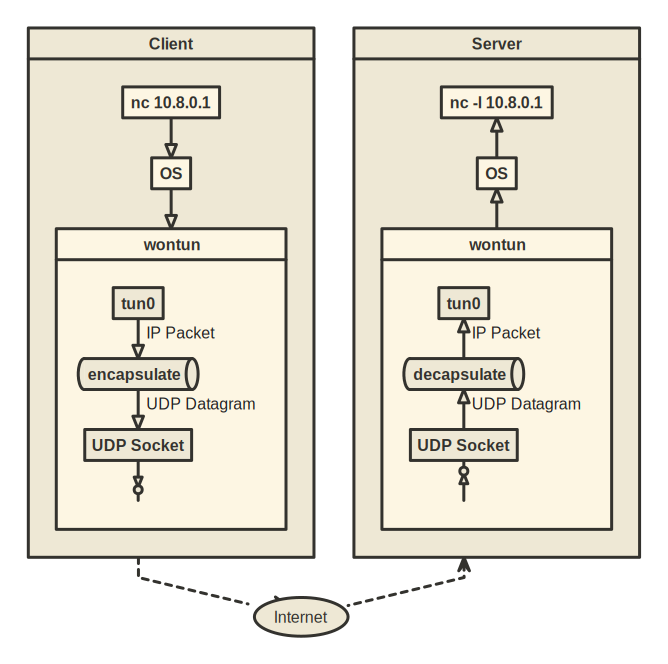
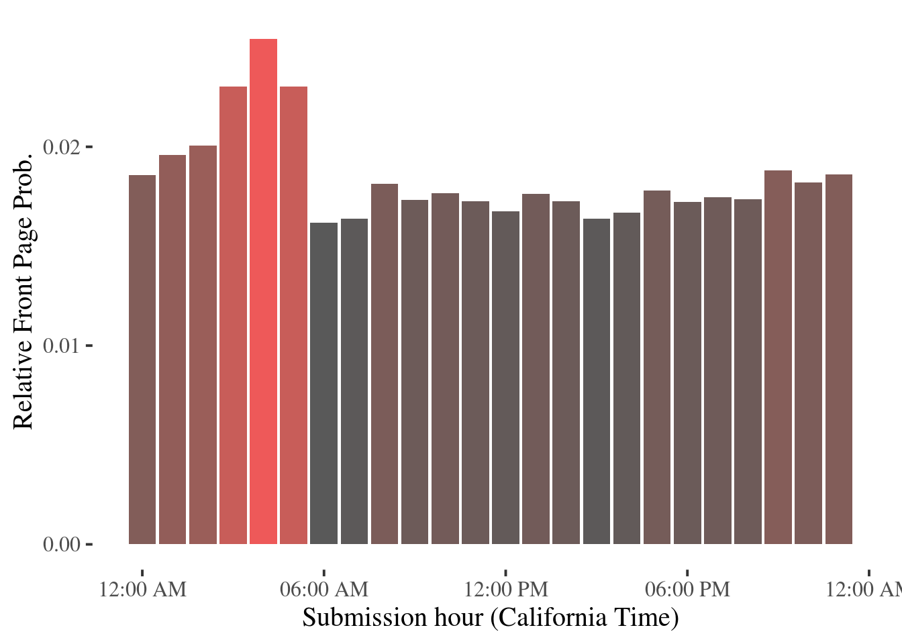
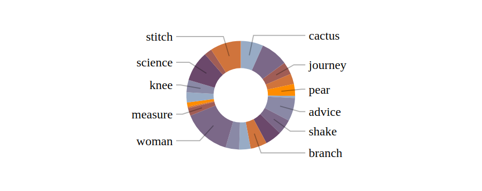
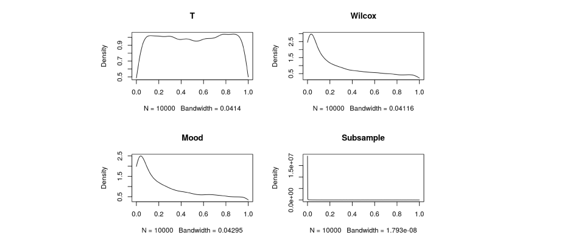

## [Understanding call/cc](callcc)

I set up this blog almost eight years ago. I was learning about functional programming at the time, and chose to implement the static site building pipelines in JavaScript - with a custom made monadic CPS framework. It was the worst code I have ever written, even if it is still functional. Every single bug fix over the years was hair-pulling difficult, truly one of the worst in terms of maintainability (I am too embarrassed to link the code here).

Nonetheless, I still consider the knowledge gained in learning about and implementing an ill-advised version of continuation monads valuable. The problem was, I had forgotten about most of what I learned back then. I wrote this article as a refresher for myself.

## [Write a Toy VPN in Rust](vpn)

In this article, we embark on a detailed journey to create `wontun`, a simplified version of the `wireguard` VPN, using Rust. The project serves as an educational exploration into the realms of low-level network programming and system administration tools, deliberately sidelining complexities like security and encryption to focus on the fundamentals of packet routing within a VPN. Key concepts such as `tun/tap` interfaces, `epoll` mechanisms, and Linux IP routing are examined and implemented, providing valuable insights into the workings of virtual network interfaces and event-driven I/O. 

## [Analyzing Hacker News Front Page Activities](hnstats)

Random and mildly interesting exploratory analysis and visualizations on Hack News activity data.

[Read](hnstats)

## [Pie Chart Callout Layout with Graph Algorithms](pie-layout)

A small exercise on a simple graph algorithm, addressing the problem of dynamic pie chart label layout: given a set of vertically overlapping labels with some non-negative weights associated with them, return a subset, such that:

1. Labels in the subset do not overlap with each other
2. Maximizes sum of weights among all non-overlapping subsets 

[Read](pie-layout)

## [Anatomy of JavaScript Method Chaining](js-chain)

In this article, we will try to distill method chaining to its essence, making a distinction of mutable vs immutable chaining, and draw some parallels with composition in functional programming.

[Read](js-chain)

## [Functional JavaScript: An Example of Equational Reasoning](js-functional-array)

In this article, I will demonstrate equational reasoning by focus on a key data structure in javaScript: Arrays. Alternatively, proving monad laws mathematically with javaScript syntax.  

[Read](js-functional-array)

## [Test Population Median Equality for Discrete Distributions](on-median)

Simulation based examination of various statistical tests for median equality null for discrete r.v.: T-test, Wilcox rank sum, Mood Test and Bootstrapping. Findings:

* If we know nothing about the population, all of the proposed tests are not reliable

* Mood Test tends to reject more often, it might be a good test for contentious distributions, but turns out to be a poor fit for discrete distributions, which can have identical medians yet fail to satisfy Mood’s Test  condition

* Subsampling/Bootstrapping tend to over-reject as well, especially when sample median is biased

* When population mean and population median can be assumed to be equal, T Test is very robust despite its obvious theoretical shortcomings

* Wilcox rank sum test is a general close second following T Test, and has good robustness

[Read](on-median)

## [Obligatory Hello World](hello-world)

[Read](hello-world)
