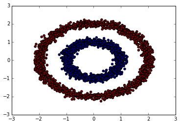
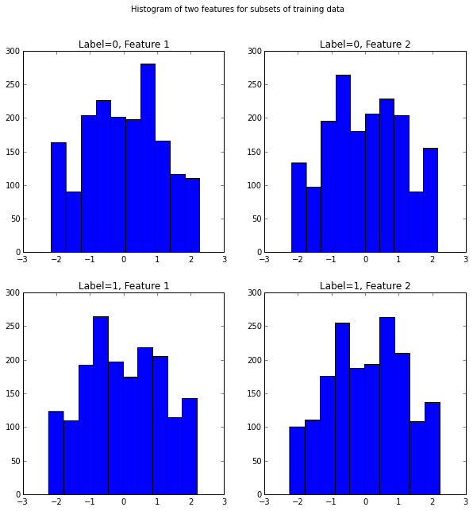

```python
%matplotlib inline

import matplotlib.pyplot as plt
import numpy as np

from sklearn.base import ClassifierMixin

from sklearn.neighbors import KNeighborsClassifier
from sklearn.naive_bayes import GaussianNB
from sklearn.linear_model import LogisticRegression
from sklearn.tree import DecisionTreeClassifier

# from sklearn.datasets import load_iris

```

## Data Generation

Here's the big reveal. This simple dataset is in fact artifitial. The two classes (Label = 0 / 1) are merely two rings of radius 1 and 2, with a little bit randomness spiced in. To be more specific, we sampled from two independent random variables:

$$\mathbf{R} \sim \text{Gaussian}$$

$$\mathbf{\theta} \sim \text{Uniform}$$

With respect to different labels, the parameters of distributions are:

$$\mathbf{R|Y=0} \sim N(1, 0.1)$$

$$\mathbf{R|Y=1} \sim N(2, 0.1)$$

$$\mathbf{\theta} \sim U(0, 2\pi)$$

Each sample is just a pair of $r_i$ and $\theta_i$ values: $(r_i, \theta_i)$ given $y_i$. However, the final dataset exposed to classifiers has undergone an additional step of transformation, we present the Cartesian coordinations $(x,y)$ to ML models, rather than raw $(r, \theta)$ pairs. That is:

$$\mathbf{X} = \mathbf{R} \cos(\theta)$$

$$\mathbf{Y} = \mathbf{R} \sin(\theta)$$

The dataset features (variable `X`) are a 2d numpy array, each row being $(x_i, y_i)$ generated this way. 


```python
def ring_data(r, sigma=0.1, size=2500):
    '''
    Create (r, theta) pairs where 
      r ~ Normal
      theta ~ Uniform(0, 2 * PI)
    '''
    rs, thetas = np.random.normal(r, sigma, size), \
                 np.random.uniform(0, np.pi * 2, size)
    return np.column_stack((rs, thetas))

def gen_dataset_polar(size=2500):
    '''
    Generate random dataset with labels 0/1
    features are polar coordinates
    For Y=0:  r ~= 1
    For Y=1:  r ~= 2
    theta values are uniformly distributed in [0, 2 * PI]
    '''
    X = np.row_stack((ring_data(1, size=size), 
                      ring_data(2, size=size)) )
    Y = np.array((np.zeros(size), np.ones(size))).reshape((size*2,))
    return X,Y

def pol2cart(X):
    '''
    Polar to Cartesian 
    2d array -> 2d array
    '''
    r = X[:,0]
    theta = X[:,1]
    return np.column_stack((np.cos(theta) * r, 
                            np.sin(theta) *r))
np.random.seed(0)
X0, Y = gen_dataset_polar()

shuffle = np.random.permutation(np.arange(X0.shape[0]))
X0, Y = X0[shuffle], Y[shuffle]

X = pol2cart(X0) 

train_data, train_labels = X[1500:], Y[1500:]
test_data, test_labels = X[:1500], Y[:1500]
```

A basic scatteplot of the dataset captures pretty much the whole story about how this dataset is constructed.


```python
def vis(X, Y):
    plt.scatter(X[:,0], X[:,1],c=Y)
    
vis(train_data, train_labels)
```





```python
idx_0 = np.argwhere(train_labels!=1.0).ravel()
idx_1 = np.argwhere(train_labels==1.0).ravel()

fig, axarr = plt.subplots(2, 2)
axarr[0,0].hist(X[idx_0,0])
axarr[0,0].set_title('Label=0, Feature 1')
axarr[0,1].hist(X[idx_0,1])
axarr[0,1].set_title('Label=0, Feature 2')
axarr[1,0].hist(X[idx_1,0])
axarr[1,0].set_title('Label=1, Feature 1')
axarr[1,1].hist(X[idx_1,1])
axarr[1,1].set_title('Label=1, Feature 2')
fig.suptitle('Histogram of two features for subsets of training data')
fig.set_figheight(10)
fig.set_figwidth(10)


```





```python
class DicerollClassifier(ClassifierMixin):
    def __init__(self):
        self.classes = None
        self.label_probs = None
    
    def fit(self, train_data, train_labels):
        classes, counts = np.unique(train_labels, return_counts=True)
        self.classes = classes
        self.label_probs = counts.astype('float64') / train_labels.shape[0]
    
    # Make predictions for each test example and return results.
    def predict(self, test_data):
        n = test_data.shape[0]
        return np.random.choice(self.classes, size=n, 
                                replace=True,
                                p=self.label_probs)
```


```python
diceroll = DicerollClassifier()

diceroll.fit(train_data, train_labels)

diceroll.score(test_data, test_labels)

```


    0.49933333333333335


```python
knn = KNeighborsClassifier(n_neighbors=4, algorithm='ball_tree')

knn.fit(train_data, train_labels)

knn.score(test_data, test_labels)


```


    1.0


```python
gnb = GaussianNB()

gnb.fit(train_data, train_labels)
gnb.score(test_data, test_labels)
```


    1.0


```python
dtc = DecisionTreeClassifier()

dtc.fit(train_data, train_labels)
dtc.score(test_data, test_labels)
```


    0.998


```python
logit = LogisticRegression(penalty='l2')

logit.fit(train_data, train_labels)
logit.score(test_data, test_labels)
```


    0.51800000000000002


```python
class NNLogisticRegression(object):
    """Multi-class Logistic Regression Class

    The logistic regression is fully described by a weight matrix :math:`W`
    and bias vector :math:`b`. Classification is done by projecting data
    points onto a set of hyperplanes, the distance to which is used to
    determine a class membership probability.
    """

    def __init__(self, input, n_in, n_out):
        """ Initialize the parameters of the logistic regression

        :type input: theano.tensor.TensorType
        :param input: symbolic variable that describes the input of the
                      architecture (one minibatch)

        :type n_in: int
        :param n_in: number of input units, the dimension of the space in
                     which the datapoints lie

        :type n_out: int
        :param n_out: number of output units, the dimension of the space in
                      which the labels lie

        """
        # start-snippet-1
        # initialize with 0 the weights W as a matrix of shape (n_in, n_out)
        self.W = theano.shared(
            value=np.zeros(
                (n_in, n_out),
                dtype=theano.config.floatX
            ),
            name='W',
            borrow=True
        )
        # initialize the biases b as a vector of n_out 0s
        self.b = theano.shared(
            value=np.zeros(
                (n_out,),
                dtype=theano.config.floatX
            ),
            name='b',
            borrow=True
        )

        # symbolic expression for computing the matrix of class-membership
        # probabilities
        # Where:
        # W is a matrix where column-k represent the separation hyperplane for
        # class-k
        # x is a matrix where row-j  represents input training sample-j
        # b is a vector where element-k represent the free parameter of
        # hyperplane-k
        self.p_y_given_x = T.nnet.softmax(T.dot(input, self.W) + self.b)

        # symbolic description of how to compute prediction as class whose
        # probability is maximal
        self.y_pred = T.argmax(self.p_y_given_x, axis=1)
        # end-snippet-1

        # parameters of the model
        self.params = [self.W, self.b]

        # keep track of model input
        self.input = input

    def negative_log_likelihood(self, y):
        """Return the mean of the negative log-likelihood of the prediction
        of this model under a given target distribution.

        .. math::

            \frac{1}{|\mathcal{D}|} \mathcal{L} (\theta=\{W,b\}, \mathcal{D}) =
            \frac{1}{|\mathcal{D}|} \sum_{i=0}^{|\mathcal{D}|}
                \log(P(Y=y^{(i)}|x^{(i)}, W,b)) \\
            \ell (\theta=\{W,b\}, \mathcal{D})

        :type y: theano.tensor.TensorType
        :param y: corresponds to a vector that gives for each example the
                  correct label

        Note: we use the mean instead of the sum so that
              the learning rate is less dependent on the batch size
        """
        # start-snippet-2
        # y.shape[0] is (symbolically) the number of rows in y, i.e.,
        # number of examples (call it n) in the minibatch
        # T.arange(y.shape[0]) is a symbolic vector which will contain
        # [0,1,2,... n-1] T.log(self.p_y_given_x) is a matrix of
        # Log-Probabilities (call it LP) with one row per example and
        # one column per class LP[T.arange(y.shape[0]),y] is a vector
        # v containing [LP[0,y[0]], LP[1,y[1]], LP[2,y[2]], ...,
        # LP[n-1,y[n-1]]] and T.mean(LP[T.arange(y.shape[0]),y]) is
        # the mean (across minibatch examples) of the elements in v,
        # i.e., the mean log-likelihood across the minibatch.
        return -T.mean(T.log(self.p_y_given_x)[T.arange(y.shape[0]), y])
        # end-snippet-2

    def errors(self, y):
        """Return a float representing the number of errors in the minibatch
        over the total number of examples of the minibatch ; zero one
        loss over the size of the minibatch

        :type y: theano.tensor.TensorType
        :param y: corresponds to a vector that gives for each example the
                  correct label
        """

        # check if y has same dimension of y_pred
        if y.ndim != self.y_pred.ndim:
            raise TypeError(
                'y should have the same shape as self.y_pred',
                ('y', y.type, 'y_pred', self.y_pred.type)
            )
        # check if y is of the correct datatype
        if y.dtype.startswith('int'):
            # the T.neq operator returns a vector of 0s and 1s, where 1
            # represents a mistake in prediction
            return T.mean(T.neq(self.y_pred, y))
        else:
            raise NotImplementedError()
            

            
class HiddenLayer(object):
    def __init__(self, rng, input, n_in, n_out, W=None, b=None,
                 activation=T.tanh):
        """
        Typical hidden layer of a MLP: units are fully-connected and have
        sigmoidal activation function. Weight matrix W is of shape (n_in,n_out)
        and the bias vector b is of shape (n_out,).

        NOTE : The nonlinearity used here is tanh

        Hidden unit activation is given by: tanh(dot(input,W) + b)

        :type rng: np.random.RandomState
        :param rng: a random number generator used to initialize weights

        :type input: theano.tensor.dmatrix
        :param input: a symbolic tensor of shape (n_examples, n_in)

        :type n_in: int
        :param n_in: dimensionality of input

        :type n_out: int
        :param n_out: number of hidden units

        :type activation: theano.Op or function
        :param activation: Non linearity to be applied in the hidden
                           layer
        """
        self.input = input
        # end-snippet-1

        # `W` is initialized with `W_values` which is uniformely sampled
        # from sqrt(-6./(n_in+n_hidden)) and sqrt(6./(n_in+n_hidden))
        # for tanh activation function
        # the output of uniform if converted using asarray to dtype
        # theano.config.floatX so that the code is runable on GPU
        # Note : optimal initialization of weights is dependent on the
        #        activation function used (among other things).
        #        For example, results presented in [Xavier10] suggest that you
        #        should use 4 times larger initial weights for sigmoid
        #        compared to tanh
        #        We have no info for other function, so we use the same as
        #        tanh.
        if W is None:
            W_values = np.asarray(
                rng.uniform(
                    low=-np.sqrt(6. / (n_in + n_out)),
                    high=np.sqrt(6. / (n_in + n_out)),
                    size=(n_in, n_out)
                ),
                dtype=theano.config.floatX
            )
            if activation == theano.tensor.nnet.sigmoid:
                W_values *= 4

            W = theano.shared(value=W_values, name='W', borrow=True)

        if b is None:
            b_values = np.zeros((n_out,), dtype=theano.config.floatX)
            b = theano.shared(value=b_values, name='b', borrow=True)

        self.W = W
        self.b = b

        lin_output = T.dot(input, self.W) + self.b
        self.output = (
            lin_output if activation is None
            else activation(lin_output)
        )
        # parameters of the model
        self.params = [self.W, self.b]


# start-snippet-2
class MLP(object):
    """Multi-Layer Perceptron Class

    A multilayer perceptron is a feedforward artificial neural network model
    that has one layer or more of hidden units and nonlinear activations.
    Intermediate layers usually have as activation function tanh or the
    sigmoid function (defined here by a ``HiddenLayer`` class)  while the
    top layer is a softmax layer (defined here by a ``LogisticRegression``
    class).
    """

    def __init__(self, rng, input, n_in, n_hidden, n_out):
        """Initialize the parameters for the multilayer perceptron

        :type rng: np.random.RandomState
        :param rng: a random number generator used to initialize weights

        :type input: theano.tensor.TensorType
        :param input: symbolic variable that describes the input of the
        architecture (one minibatch)

        :type n_in: int
        :param n_in: number of input units, the dimension of the space in
        which the datapoints lie

        :type n_hidden: int
        :param n_hidden: number of hidden units

        :type n_out: int
        :param n_out: number of output units, the dimension of the space in
        which the labels lie

        """

        # Since we are dealing with a one hidden layer MLP, this will translate
        # into a HiddenLayer with a tanh activation function connected to the
        # LogisticRegression layer; the activation function can be replaced by
        # sigmoid or any other nonlinear function
        self.hiddenLayer = HiddenLayer(
            rng=rng,
            input=input,
            n_in=n_in,
            n_out=n_hidden,
            activation=T.tanh
        )

        # The logistic regression layer gets as input the hidden units
        # of the hidden layer
        self.logRegressionLayer = NNLogisticRegression(
            input=self.hiddenLayer.output,
            n_in=n_hidden,
            n_out=n_out
        )
        # end-snippet-2 start-snippet-3
        # L1 norm ; one regularization option is to enforce L1 norm to
        # be small
        self.L1 = (
            abs(self.hiddenLayer.W).sum()
            + abs(self.logRegressionLayer.W).sum()
        )

        # square of L2 norm ; one regularization option is to enforce
        # square of L2 norm to be small
        self.L2_sqr = (
            (self.hiddenLayer.W ** 2).sum()
            + (self.logRegressionLayer.W ** 2).sum()
        )

        # negative log likelihood of the MLP is given by the negative
        # log likelihood of the output of the model, computed in the
        # logistic regression layer
        self.negative_log_likelihood = (
            self.logRegressionLayer.negative_log_likelihood
        )
        # same holds for the function computing the number of errors
        self.errors = self.logRegressionLayer.errors

        # the parameters of the model are the parameters of the two layer it is
        # made out of
        self.params = self.hiddenLayer.params + self.logRegressionLayer.params
        # end-snippet-3

        # keep track of model input
        self.input = input


def test_mlp(learning_rate=0.01, L1_reg=0.00, L2_reg=0.0001, n_epochs=1000, batch_size=20, n_hidden=50):
    """
    Demonstrate stochastic gradient descent optimization for a multilayer
    perceptron
    
    :type learning_rate: float
    :param learning_rate: learning rate used (factor for the stochastic
    gradient

    :type L1_reg: float
    :param L1_reg: L1-norm's weight when added to the cost (see
    regularization)

    :type L2_reg: float
    :param L2_reg: L2-norm's weight when added to the cost (see
    regularization)

    :type n_epochs: int
    :param n_epochs: maximal number of epochs to run the optimizer
    """

    valid_data = train_data[:500]
    valid_labels = train_labels[:500]
    
    train_data2 = train_data[500:]
    train_labels2 = train_labels[500:]
    
    
    train_set_x = theano.shared(train_data2.astype(theano.config.floatX))
    train_set_y = theano.shared(train_labels2.astype('int32'))
    
    valid_set_x = theano.shared(valid_data.astype(theano.config.floatX))
    valid_set_y = theano.shared(valid_labels.astype('int32'))
    
    test_set_x = theano.shared(test_data.astype(theano.config.floatX))
    test_set_y = theano.shared(test_labels.astype('int32'))
    
    # compute number of minibatches for training, validation and testing
    n_train_batches = train_set_x.get_value(borrow=True).shape[0] // batch_size
    n_valid_batches = valid_set_x.get_value(borrow=True).shape[0] // batch_size
    n_test_batches = test_set_x.get_value(borrow=True).shape[0] // batch_size

    ######################
    # BUILD ACTUAL MODEL #
    ######################
    print('... building the model')

    # allocate symbolic variables for the data
    index = T.lscalar()  # index to a [mini]batch
    x = T.matrix('x')  # the data is presented as rasterized images
    y = T.ivector('y')  # the labels are presented as 1D vector of
                        # [int] labels

    rng = np.random.RandomState(1234)

    # construct the MLP class
    classifier = MLP(
        rng=rng,
        input=x,
        n_in=2,
        n_hidden=n_hidden,
        n_out=2
    )

    # start-snippet-4
    # the cost we minimize during training is the negative log likelihood of
    # the model plus the regularization terms (L1 and L2); cost is expressed
    # here symbolically
    cost = (
        classifier.negative_log_likelihood(y)
        + L1_reg * classifier.L1
        + L2_reg * classifier.L2_sqr
    )
    # end-snippet-4

    # compiling a Theano function that computes the mistakes that are made
    # by the model on a minibatch
    test_model = theano.function(
        inputs=[index],
        outputs=classifier.errors(y),
        givens={
            x: test_set_x[index * batch_size:(index + 1) * batch_size],
            y: test_set_y[index * batch_size:(index + 1) * batch_size]
        }
    )

    validate_model = theano.function(
        inputs=[index],
        outputs=classifier.errors(y),
        givens={
            x: valid_set_x[index * batch_size:(index + 1) * batch_size],
            y: valid_set_y[index * batch_size:(index + 1) * batch_size]
        }
    )

    # start-snippet-5
    # compute the gradient of cost with respect to theta (sotred in params)
    # the resulting gradients will be stored in a list gparams
    gparams = [T.grad(cost, param) for param in classifier.params]

    # specify how to update the parameters of the model as a list of
    # (variable, update expression) pairs

    # given two lists of the same length, A = [a1, a2, a3, a4] and
    # B = [b1, b2, b3, b4], zip generates a list C of same size, where each
    # element is a pair formed from the two lists :
    #    C = [(a1, b1), (a2, b2), (a3, b3), (a4, b4)]
    updates = [
        (param, param - learning_rate * gparam)
        for param, gparam in zip(classifier.params, gparams)
    ]

    # compiling a Theano function `train_model` that returns the cost, but
    # in the same time updates the parameter of the model based on the rules
    # defined in `updates`
    train_model = theano.function(
        inputs=[index],
        outputs=cost,
        updates=updates,
        givens={
            x: train_set_x[index * batch_size: (index + 1) * batch_size],
            y: train_set_y[index * batch_size: (index + 1) * batch_size]
        }
    )
    # end-snippet-5

    ###############
    # TRAIN MODEL #
    ###############
    print('... training')

    # early-stopping parameters
    patience = 10000  # look as this many examples regardless
    patience_increase = 2  # wait this much longer when a new best is
                           # found
    improvement_threshold = 0.995  # a relative improvement of this much is
                                   # considered significant
    validation_frequency = min(n_train_batches, patience // 2)
                                  # go through this many
                                  # minibatche before checking the network
                                  # on the validation set; in this case we
                                  # check every epoch

    best_validation_loss = np.inf
    best_iter = 0
    test_score = 0.
    start_time = timeit.default_timer()

    epoch = 0
    done_looping = False

    while (epoch < n_epochs) and (not done_looping):
        epoch = epoch + 1
        for minibatch_index in range(n_train_batches):

            minibatch_avg_cost = train_model(minibatch_index)
            # iteration number
            iter = (epoch - 1) * n_train_batches + minibatch_index

            if (iter + 1) % validation_frequency == 0:
                # compute zero-one loss on validation set
                validation_losses = [validate_model(i) for i
                                     in range(n_valid_batches)]
                this_validation_loss = np.mean(validation_losses)

                # if we got the best validation score until now
                if this_validation_loss < best_validation_loss:
                    #improve patience if loss improvement is good enough
                    if (
                        this_validation_loss < best_validation_loss *
                        improvement_threshold
                    ):
                        patience = max(patience, iter * patience_increase)

                    best_validation_loss = this_validation_loss
                    best_iter = iter

                    # test it on the test set
                    test_losses = [test_model(i) for i
                                   in range(n_test_batches)]
                    test_score = np.mean(test_losses)

                    print(('     epoch %i, minibatch %i/%i, test error of '
                           'best model %f %%') %
                          (epoch, minibatch_index + 1, n_train_batches,
                           test_score * 100.))

            if patience <= iter:
                done_looping = True
                break

    end_time = timeit.default_timer()
    print(('Optimization complete. Best validation score of %f %% '
           'obtained at iteration %i, with test performance %f %%') %
          (best_validation_loss * 100., best_iter + 1, test_score * 100.))

test_mlp(n_hidden=20)
```

    ... building the model
    ... training
         epoch 1, minibatch 150/150, test error of best model 44.866667 %
         epoch 2, minibatch 150/150, test error of best model 44.266667 %
         epoch 4, minibatch 150/150, test error of best model 43.800000 %
         epoch 9, minibatch 150/150, test error of best model 44.000000 %
         epoch 31, minibatch 150/150, test error of best model 41.933333 %
         epoch 32, minibatch 150/150, test error of best model 41.400000 %
         epoch 33, minibatch 150/150, test error of best model 40.666667 %
         epoch 34, minibatch 150/150, test error of best model 39.133333 %
         epoch 36, minibatch 150/150, test error of best model 36.733333 %
         epoch 37, minibatch 150/150, test error of best model 35.333333 %
         epoch 38, minibatch 150/150, test error of best model 34.400000 %
         epoch 39, minibatch 150/150, test error of best model 32.733333 %
         epoch 40, minibatch 150/150, test error of best model 30.666667 %
         epoch 41, minibatch 150/150, test error of best model 28.266667 %
         epoch 42, minibatch 150/150, test error of best model 26.666667 %
         epoch 43, minibatch 150/150, test error of best model 25.466667 %
         epoch 44, minibatch 150/150, test error of best model 24.133333 %
         epoch 45, minibatch 150/150, test error of best model 23.600000 %
         epoch 46, minibatch 150/150, test error of best model 22.600000 %
         epoch 47, minibatch 150/150, test error of best model 21.600000 %
         epoch 48, minibatch 150/150, test error of best model 20.866667 %
         epoch 49, minibatch 150/150, test error of best model 20.400000 %
         epoch 50, minibatch 150/150, test error of best model 20.000000 %
         epoch 51, minibatch 150/150, test error of best model 19.533333 %
         epoch 52, minibatch 150/150, test error of best model 18.933333 %
         epoch 53, minibatch 150/150, test error of best model 18.733333 %
         epoch 54, minibatch 150/150, test error of best model 18.533333 %
         epoch 55, minibatch 150/150, test error of best model 18.400000 %
         epoch 57, minibatch 150/150, test error of best model 17.733333 %
         epoch 58, minibatch 150/150, test error of best model 17.266667 %
         epoch 59, minibatch 150/150, test error of best model 15.266667 %
         epoch 60, minibatch 150/150, test error of best model 13.533333 %
         epoch 61, minibatch 150/150, test error of best model 11.733333 %
         epoch 62, minibatch 150/150, test error of best model 10.533333 %
         epoch 63, minibatch 150/150, test error of best model 8.933333 %
         epoch 64, minibatch 150/150, test error of best model 7.666667 %
         epoch 65, minibatch 150/150, test error of best model 6.533333 %
         epoch 66, minibatch 150/150, test error of best model 5.666667 %
         epoch 67, minibatch 150/150, test error of best model 4.800000 %
         epoch 68, minibatch 150/150, test error of best model 4.066667 %
         epoch 69, minibatch 150/150, test error of best model 3.866667 %
         epoch 70, minibatch 150/150, test error of best model 3.666667 %
         epoch 71, minibatch 150/150, test error of best model 2.733333 %
         epoch 72, minibatch 150/150, test error of best model 2.533333 %
         epoch 73, minibatch 150/150, test error of best model 2.200000 %
         epoch 74, minibatch 150/150, test error of best model 1.400000 %
         epoch 75, minibatch 150/150, test error of best model 0.933333 %
         epoch 76, minibatch 150/150, test error of best model 0.733333 %
         epoch 78, minibatch 150/150, test error of best model 0.400000 %
         epoch 79, minibatch 150/150, test error of best model 0.266667 %
    Optimization complete. Best validation score of 0.000000 % obtained at iteration 11850, with test performance 0.266667 %
