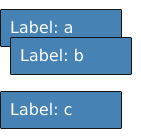

```{r setup, include=FALSE}
knitr::opts_chunk$set(echo = TRUE)
```

## Introduction

Recently I dug up some notes from 2 years ago, about a problem I encountered at work. It is a challenge for responsiveness layout for a simple visualization type: pie chart.  Here's a quick demo:

* Try resize the chart area (make it smaller)
* Notice not all pie slices have a callout labels displayed
* Labels are dynamically removed if available areas are too small

<aside>
<div>
#### Side Note
Pinch-zoom on mobile is a little bit janky, but hopefully, it's good enough to show the gist this layout behavior.
</div>
</aside>

<iframe class="embed" width="48em" src="http://write.yiransheng.com/d3-piechart-callout-layout/" />

<script data-keep="true">
function resize(node) {
  if (!node) {
    return;
  }
  var parent = node.parentNode;
  if (parent) {
    var width = parent.getBoundingClientRect().width;
    width = Math.max(width, 300);
    var height = Math.min(Math.ceil(width * 0.55), 480);
    height = Math.max(height, 200);
    node.setAttribute('width', width);
    node.setAttribute('height', height);
  }
}
function resizeAll() {
  var iframes = document.querySelectorAll('iframe');
  for (var i=0; i<iframes.length; i++) {
    resize(iframes[i]);
  }
}
resizeAll();
document.addEventListener('resize', requestIdleCallback ? function () { requestIdleCallback(resizeAll); } : resizeAll);
</script>

The code for this d3 chart is adapted from: http://bl.ocks.org/dbuezas/9306799

We had found a pretty good divide and conquer solution, and iterated on it quite a bit. However, going through my notes, I have came up another formulation and solution for this problem, albeit, with worse time complexity. This new idea is based on a graph representation of the problem, I find it quite neat (though I am certain this has been well-covered in CS literatures).

I wrote this version of the solution in `rust` and `WebAssembly`, and it is used in the demo above.

## Problem Description

For a simple pie chart like above, we have two columns of callout labels. Notice on each side, labels are aligned horizontally (either left or right-aligned). For either side, we want the following:

* Labels should never overlap, regardless of available screen estate (height-wise)
* We'd like to keep as many "important" labels as possible - by some criteria of importance

In context of pie charts, it makes sense we would prefer labels for slices with larger arcs. People probably usually want to know about components with the largest shares among the total. Alternatively, we may want to ignore the share of pie for each label, and aim to maximize number of labels kept.

In both situations, we could provide a weight function for each label (using integer as weights for simplicity):
$$
w: \text{Label} \rightarrow \mathbb{N}
$$
For maximizing remaining number of labels , this function is simply a constant function:
$$
w(L) := 1
$$
The inputs (labels) can be represented as a set of 1-d intervals, corresponding to their y coordinates. Given a set $\mathbf{L}$ of weighted labels , we want to find a non-overlapping subset of $\mathbf{L}$:
$$
\mathbf{X} = \arg\max_{\mathbf{X} \subset \mathbf{L}} \Sigma_{X_i \in \mathbf{X}}w(X_i) \\
$$

where

$$
\forall X_i, X_j\in \mathbf{X} \quad X_i \nsim X_j \text{ if } i \neq j
$$


Here we define operator $\nsim$ as non-overlapping binary relation, $I_a \nsim I_b \iff \text{len}(I_a \cap I_b)  = 0$. We do not require the intersection of two intervals to be empty for them to be considered non-overlapping, they could share a single boundary point (eg. $[1, 2]$ and $[2, 3]$ are considered non-overlapping). 

## Simple Algebraic Properties of Intervals

The operator $\nsim$ defined here is not a very nice binary relation. It is symmetric, that is, $I_a \nsim I_b \Rightarrow I_b \nsim I_a$. But it is not transitive, $I_a \nsim I_b, I_b \nsim I_c  \nRightarrow I_a \nsim I_c$. Here's an example:

$$
I_a = [0, 2] \\
I_b = [5, 6] \\
I_c = [1, 3] \\
$$

$I_a$ does not overlap with $I_b$, and $I_b$ does not overlap with $I_c$, but $I_a$ does overlap with $I_c$.

On the other hand, we could discard symmetry, and try to come up with another relation for intervals that is in fact transitive. This is also very straight-forward, let's call this new relation $\prec$, defined as:

$$
\forall I_1 = [a, b], I_2 = [c, d] \quad I_1 \prec I_2 \iff c >= b
$$

Clearly, $I_a \prec I_b \implies I_a \nsim I_b$. Also, $I_a \nsim I_b \implies I_a \prec I_b \text{ or } I_b \prec I_a$. The $\prec$ relation sates the right hand side interval strictly follows the left hand side without any overlaps. And it's easy to verify $\prec$ is in fact transitive. Furthermore $\prec$ is not defined for two overlapping intervals. 

What's good about $\prec$, well, it is a strict partial order:

* It's _irreflexive_, that is $I \prec I$ is not defined for any interval (an interval always overlaps with itself)
* It is _antisymmetric_, if $I_a \prec I_b$, then $I_b \prec I_a$ must not hold
* It is transitive

## The Algorithm 

A partial order relation is closely tied to DAGs (Directed acyclic graph). Any finite strict partially ordered set can be represented as a DAG. Note our input intervals is exactly this. Recall the desired output $\mathbf{X}$ must satisfy:

$$
\forall X_i, X_j\in \mathbf{X} \quad\ X_i \nsim X_j \text{ if } i \neq j
$$

Expressed using $\prec$:

$$
\forall X_i, X_j\in \mathbf{X} \quad X_i \prec X_j \text{ or } X_j \prec X_i \text{ if } i \neq j
$$

Looking at it this way, we are basically looking for a [chain](https://en.wikipedia.org/wiki/Total_order#Chains) or a strictly total ordered subset of the input  partially ordered set. Stated in graph terms, we are looking for a _path_ in a given DAG. 

With this realization, now it's time to construct this DAG:

* Each node in the graph is an interval, it has a non-negative weight
* Each edge corresponds to the $\prec$ relation, that is `node_i` connects to `node_j` if and only if `node_i` $\prec$ `node_j`
* In addition, we add two dummy nodes:
    - `start_node`, it has a weight 0, and connects to all the nodes in the input set
    - `end_node`, it has a weight 0, and all input nodes connect to it

To illustrate, this set of three labels:

<center>

</center>

Translates into this graph:

```{r, fig1, fig.height = 3.5, fig.width = 6, fig.align = "center", out.width = '80%', echo=FALSE, message=FALSE}
library(igraph)
graph_from_literal( S-+a, S-+b, S-+c, a-+c, b-+c, a-+E, b-+E, c-+E) -> g
l <- cbind(seq(0, 200, 50), c(0,0,0.2,0,0))

# par(pin=c(8, 4))
# par(pin=c(6,4), pty="m", plt=c(0,100,0,100))
plot(g, asp=0.3, layout=l, vertex.size=18, vertex.color=c("lightgrey","white","white","white","lightgrey"), edge.curved=0.4)
```

The problem becomes finding a path from `start_node` to `end_node`, with largest sum of node weights -  a variant of the longest path problem.

A quick good search for "longest path graph" points to this link: http://www.mathcs.emory.edu/~cheung/Courses/171/Syllabus/11-Graph/Docs/longest-path-in-dag.pdf

It gives a very succinct solution, keyword _dynamic programming_:

1. Conduct a topological sort on the graph, finding out a linearized order of its nodes
2. Finding a path with largest node weights ending at `node_i` requires finding paths ending in all its predecessors  `node_j` with same property up to `j` (based on the linearized order)
3. Pick the path from `node_j` that has the largest accumulated weight `w_j`, and mark the total weight up to `node_i` as `w_j` + `weight(node_i)`
4. Continue until reaching `end_node`

## Actual Code

I chose rust for implementing this for two reasons:

1. I have been learning rust for quite a while now, it's fun and additcting
2. rust has a `PartialOrd` trait that's particularly suitable representing this problem

To illustrate the second point, I used this trait to represent an input label/weighted interval:

```rust
trait Weighted: PartialOrd {
    fn weight(&self) -> u32;
}
```

Three lines of code and that's it, all the solution code just needs to work with this trait generically, and does not even to have any notion of intervals or labels.

Here is entry function, it returns a list of indices to keep:

```rust
fn solve<W: Weighted>(inputs: &[W]) -> Vec<uszie> {
    let g = build_graph(inputs);
    g.longest_path()
}
struct Graph {
    nodes: Vec<Node>
}
impl Graph {
    fn longest_path(mut self) -> Vec<usize> {
        //...
    }
}
fn build_graph<W: Weighted>(inputs: &[W]) -> Graph {
    // ..
}
```

`Graph` is a simple adjacency list representation storing a `Vec` of nodes, referencing each node with its index.

`Node` struct:

```rust
struct Node {
    predecessors: IntHashSet<usize>,
    weight: u32,
    dist: u32,
    path_predecessor: Option<usize>,
}
```

Field `predecessors` is a list of indices for its predecessor nodes, I am using an `IntHashSet` here not necessarily for any performance reason, but for making certain part of the code a little less verbose, I suspect a plain `Vec` might actually perform better for realistic work loads.

All nodes' `dist` field are initialized to be 0, and its `path_predecessor`  as `None`. Calling `longest_path` method consumes the graph, runs the dynamic programming loop, and populates these fields for each node in linear (`O(V + E)`) time.

### Topological Sort

I have tried a few graph algorithm crate for this task, and ended up picking [pathfinding](https://docs.rs/pathfinding/1.0.4/pathfinding/directed/topological_sort/fn.topological_sort.html), as it is easiest to use, and has an unassuming api - just a plain function, not requiring any specific graph representation or traits implementations.

These few lines of code does the job:

```rust
impl Graph {
    fn longest_path(mut self) -> Vec<usize> {
        //...
        let mut sorted = topological_sort(&node_ids, |node_id| {
            let node = &self.nodes[*node_id];
            node.predecessors.iter().map(|id| *id)
        }).unwrap();

        sorted.reverse();

        // dynamic programming loop
        for i in 0..n {
            self.mark_longest_path_for(sorted[i]);
        }        
        // ...
    }
} 
```

### Dynamic Programming

This is the method solving  a single sub-problem, assign a `path_predecessor` for a single node, and update its accumulated path weight (`node.dist`).

```rust
impl Graph {
    fn mark_longest_path_for(&mut self, node_id: usize) {
        // start_node
        if node_id == 0 {
            self.nodes[0].dist = 0;
            self.nodes[0].path_predecessor = None;
            return;
        }

        let pred_dist;
        let path_predecessor;
        {
            let (i, pred_node) = self
                .predecessors(node_id)
                 // pick predecessor with largests dist
                .max_by_key(|(_, node)| node.dist) 
                .unwrap(); // assume all sub-problems before have been solved

            pred_dist = pred_node.dist;
            path_predecessor = i;
        }

        let node = &mut self.nodes[node_id];
        let weight = node.weight;

        node.dist = pred_dist + weight;
        node.path_predecessor = Some(path_predecessor);
    }
}
```

## Implementing Traits for Intervals

Finally with the functions ready, we just need to implement `PartialOrd` and `Weight` for intervals, first, a simple representation of `Interval`:

```rust
#[derive(Debug, Copy, Clone, PartialEq)]
pub struct Interval {
    lower: f64,
    upper: f64,
    weight: u32,
}
```

There is no `StrictPartialOrd` trait in `rust`, thus we'd settle for using `PartialOrd`, which requires `PartialEq`, and thankfully it's auto`derive`able. Next, we provide our `partial_cmp` implementation,

```rust
impl PartialOrd for Interval {
    fn partial_cmp(&self, other: &Self) -> Option<Ordering> {
        match self.upper.partial_cmp(&other.lower) {
            Some(Less) | Some(Equal) => return Some(Less),
            _ => {}
        };
        match other.upper.partial_cmp(&self.lower) {
            Some(Less) | Some(Equal) => return Some(Greater),
            _ => {}
        };

        None
    }
}
```

Notice, `partial_cmp` has a type signature of `-> Option<Ordering>`, but only ever returns one of these three:

* `Some(Ordering::Greater)`
* `Some(Ordering::Less)`
* `Node`

And never `Some(Ordering::Equal)`. Thus we are using it at value level as a true strict order. In addition, it is also `NaN` safe, using `f64`'s own `PartialOrd` trait implementation to guard against it.

Oh, and finally,

```rust
impl Weighted for Interval {
    fn weight(&self) -> u32 {
        self.weight
    }
}
```

## Test with Quickcheck

$$
\forall X_i, X_j\in \mathbf{X} \quad X_i \prec X_j \text{ or } X_j \prec X_i \text{ if } i \neq j
$$

```rust
fn path_overlaps<W: Weighted>(xs: &[W]) -> bool {
    let n = xs.len();
    if n < 2 {
        return false;
    }
    for i in 0..n {
        for j in 0..n {
            if i == j {
                continue;
            }
            match xs[i].partial_cmp(&xs[j]) {
                Some(Greater) | Some(Less) => {}
                _ => return true,
            }
        }
    }
    false
}
```

```rust
fn solve_brute(spans: SmallSpans<WeightedSpan>) -> SmallSpans<WeightedSpan> {
    (0..u16::max_value())
        .map(|mask| spans.subset(mask))
        .filter(|subset| !path_overlaps(subset.as_slice()))
        .max_by_key(|subset| score(subset.as_slice()))
        .unwrap_or(SmallSpans {
            spans: SmallVec::new(),
        })
}
```

```rust
quickcheck! {
    fn removes_overlapping_spans(spans: Vec<WeightedSpan>) -> bool {
        let g = build_graph(&spans);
        let path = g.longest_path();
        let retained_spans: Vec<_> =
            path.into_iter().map(|i| spans[i]).collect();

        !path_overlaps(&retained_spans)
    }
    fn check_correctness(spans: SmallSpans<WeightedSpan>) -> bool {
        // this takes a minute to run
        let g = build_graph(spans.as_slice());
        let path = g.longest_path();
        let retained_spans: Vec<_> =
            path.into_iter().map(|i| spans.spans[i]).collect();

        let solution = solve_brute(spans);

        let score_1 = score(retained_spans.as_slice());
        let score_2 = score(solution.as_slice());

        score_1 == score_2
    }
}
```

## Divide and Conquer Solution
