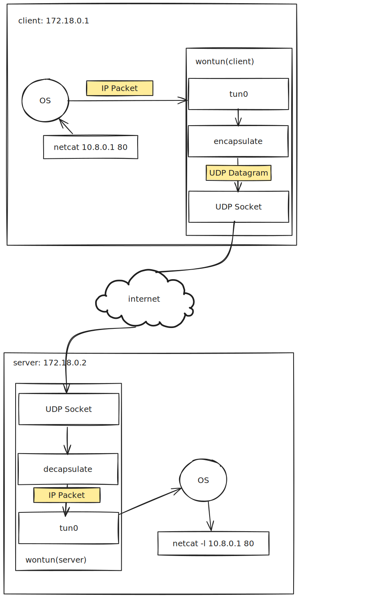

## The First Step


### Preliminaries

Before we dive into the heart of our toy VPN application, let's set the stage. Picture this: you've got a shiny VPN application, but how do you know it really works? Testing it in the wilds of the internet is like learning to swim by jumping into the deep end – possible, but probably not a great idea. So, we're going to start by simulating a more controlled environment.

First things first, we need to test our application as if it's running on two separate machines on the same Local Area Network (LAN). Why two machines, you ask? Well, a VPN isn't much of a party if it's just one lonely computer talking to itself. We need a pair to truly test the communication capabilities. Now, unless you have spare computers lying around like socks, setting up multiple machines can be a bit of a headache. Enter Docker, our virtual savior. We'll use Docker containers to mimic separate machines. It's like having a LAN party without needing to invite over your neighbor's computers.


Our setup unfolds as follows: the host machine will play the role of a client, akin to a home computer sitting behind a NAT, initiating the connection to a remote VPN server. This server, running on a public IP address, will be simulated by a Docker container. This container will be equipped with a static IP and an open port, eagerly awaiting VPN traffic. To link these two, we'll craft a Docker network bridge.

Let's start by creating our network:
```bash
docker network create wontun-test
```

To confirm its successful creation, we run:

```bash
> docker network ls

NETWORK ID     NAME          DRIVER    SCOPE
4155cab105dc   host          host      local
de1a447dc1c9   none          null      local
fe67417d0dec   wontun-test   bridge    local
```

A quick peek with the ip command reveals an interesting entry. Notice the interface name `br-fe67417d0dec`, which aligns with the network ID for wontun-test:

```bash
> ip addr show

5: br-fe67417d0dec: <NO-CARRIER,BROADCAST,MULTICAST,UP> mtu 1500 qdisc noqueue state DOWN group default
    link/ether 02:42:86:23:e4:15 brd ff:ff:ff:ff:ff:ff
    inet 172.18.0.1/16 brd 172.18.255.255 scope global br-fe67417d0dec
       valid_lft forever preferred_lft forever
```

Now if we run an image with the `--network=wontun-test`, the container will be reachable from host at the IP address `172.18.0.2` (the host machine will have the ip `172.18.0.1`) We just need to package our server binary into a docker image and run it connected to this network.

Here's the Dockerfile I crafted. It's based on Ubuntu 22.04, mirroring the host operating system. This ensures that we can compile once on the host and seamlessly use the binary inside the container. We'll install a few networking utilities (to be explained later), and copy over the Rust release binary `wontun` and a shell script `run_server.sh` into our image.

```dockerfile
FROM ubuntu:22.04

RUN apt update

RUN apt install -y iproute2 libcap2-bin netcat

COPY target/release/wontun /wontun 

COPY scripts/run_server.sh /run_server.sh

CMD bash run_server.sh
```

### Proof of Concept

In the proof of concept stage, we aim to achieve a few key outcomes:

* A single binary `wontun` is produced that can run both on the client and server (with different command line arguments)
* When both ends are running, a virtual network `10.8.0.1/24` is established between the two hosts

  * The client will have a private IP address `10.8.0.3`
  * The server will have a private IP address `10.8.0.1`
  * We can think of `172.18.0.1` and `172.18.0.2` established previously as their public IP addresses
* The moment of truth will be using `netcat`. If we can successfully run `nc -l 10.8.0.1 80` on the server and the client can connect with `nc 10.8.0.1 80`, we'll know we're on the right track. It's like sending a hello across this newly formed digital world.

```bash
# Terminal tab 1
./scripts/run_client.sh

# Terminal tab 2
docker run --name wontun-remote \
  --rm --network=wontun-test --cap-add=NET_ADMIN \
  --device=/dev/net/tun wontun-remote:latest
  
# Terminal tab 3 (run netcat)
docker exec -it wontun-remote /bin/bash
# inside the container
root@146887094cb9:/# nc -l 10.8.0.1

# Terminal tab 4
nc 10.8.0.1
```

### The Way Packets Flow

Now that we know what we are aiming for, here's a diagram illustrating how we can achieve it. This diagram only covers one half the flow: sending data from client to server, reversing the arrows yields the second half. 



For those of us not well-versed in the nitty-gritty of Linux network programming, `tun0` jumps out the most and might come off as an arcane term. Here `tun0` is the designation for a virtual network interface within your Linux system. This isn't a physical network card that you can touch but a software-created interface that acts and quacks like a real network device.

The term `tun/tap` refers to two virtual network device drivers that are part of the Linux kernel. `tun` stands for “network TUNnel” and is used to simulate a network layer device, while `tap` stands for “network tap” and simulates a link layer device. In essence, they are virtual network kernels that behave like real network devices from the point of view of your operating system. [Reference material](https://www.kernel.org/doc/Documentation/networking/tuntap.txt). I learned about it through Jon Gjengset (jonhoo)'s excellent [Implementing TCP in Rust](https://www.youtube.com/watch?v=bzja9fQWzdA) stream, which covers `tun/tap` more succinctly and in-depth.

I can attempt to dive deeper into this, but what clicked for me was to jump straight into the code, so let's do that here as well. We'll be leveraging the [`tun-tap`](https://crates.io/crates/tun-tap) crate for this task. Borrowing from the [example code](https://github.com/vorner/tuntap/blob/master/examples/dump_iface.rs) provided by the crate:

```rust
// Create the tun interface.
let iface = Iface::new("testtun", Mode::Tun).unwrap();
eprintln!("Iface: {:?}", iface);
// Configure the „local“ (kernel) endpoint.
cmd("ip", &["addr", "add", "dev", iface.name(), "10.107.1.2/24"]);
cmd("ip", &["link", "set", "up", "dev", iface.name()]);
```

The snippet above spins up a `tun` interface named "testtun". It then uses system commands to assign an IP address and activates the interface.

```rust
println!("You can for example ping 10.107.1.3 (it won't answer)");

let mut buffer = vec![0; 1504];
loop {
    // Every read is one packet. If the buffer is too small, bad luck, it gets truncated.
    let size = iface.recv(&mut buffer).unwrap();
    assert!(size >= 4);
    println!("Packet: {:?}", &buffer[4..size]);
}
```

The `testtun` can be interacted with just like a typical network interface, such as `eth0`. Pinging `10.107.1.3` will dispatch ICMP packets, which our program can intercept using `iface.recv`. Similarly, if there's a service listening on `10.107.1.2`—let's say an HTTP server on port `80`—sending a properly crafted IP packet to `10.107.1.2:80` will be correctly routed to the service.

If you're familiar with VPNs like `wireguard`, the `wg0` interface that `wg-quick` conjures up is actually a `tun` interface.

Now that we're equipped to capture raw IP packets from `tun0`, which are merely bytes, our next move is to wrap these bytes in a custom VPN protocol, packaging each into a UDP datagram. Initially, our encapsulation approach is straightforward: we simply forward the IP packets without alteration, directly to the server. On the wire, the IP packet structure resembles:

```
+---------------------------------------+                    
|    +---------------------------------+|                    
|    |     +--------------------------+||                    
| IP |UDP  |IP                        |||                    
|    |     +--------------------------+||                    
|    +---------------------------------+|                    
+---------------------------------------+ 
```

Adding this entails an extra 28 bytes of overhead due to the IP and UDP headers. If the route from client to server has an MTU (Maximum Transmission Unit) of 1500 bytes—a common default—trying to send an original IP packet of 1500 bytes will cause fragmentation, which is usually best avoided. To tackle this, we can set the `tun0` interface's MTU to a lower value, akin to `wireguard` which defaults to 1420:

```bash
ip link set dev tun0 mtu 1472
```

By doing so, we ensure that packets received from `tun0` will be at most 1472 bytes, thus avoiding fragmentation.

The reverse happens on the server: incoming UDP datagrams are unwrapped, the original IP packets are written to the `tun0` interface on the server by calling `iface.send`.

### Basic Types

Now, we roll up our sleeves and start coding. First off, we'll lay out our starter types:

```rust
use std::net::{SocketAddrV4, UdpSocket};
use tun_tap::Iface;
use parking_lot::Mutex;

pub struct Peer {
    endpoint: Mutex<Option<SocketAddrV4>>,
}

pub struct Device {
    udp: UdpSocket,
    iface: Iface,
    peer: Peer,
}
```

We'll be utilizing our friend `Iface` from the `tun-tap` crate, which, as we've discussed, represents a virtual network interface. The `Device` struct is our central entity for managing IP traffic tunneling. Unlike `wireguard`, which permits defining multiple peers per host and supports complex network configurations, our model will be more straightforward, with one peer per host.

A `Peer` for now is just a wrapper around its endpoint, which is an `Option<SocketAddrV4>` (we will be supporting IPv4 only). The address is also wrapped in a `Mutex` - this is a hint that we will be running this application in multiple threads.

To explain why `endpoint` is an `Option`, on the server side, our VPN application boots up without knowledge of its peer's IP address. This mirrors common real-world VPN scenarios where the server has a known public IP, but the client IPs, often home computers, are dynamically assigned by ISPs and not static. Consequently, clients must initiate the contact. When the server receives incoming connection attempts from clients (in our minimal setup, a single client), it responds and decides whether to authorize or reject these connections. Only after this handshake does a steady state emerge, with both the client and server aware of each other's addresses, allowing for the free flow of data packets.

### Two loops

The core logic of our application revolves around two essential loops:

1. The first loop listens for packets from the `iface` and forwards them to the `peer` using the associated `UdpSocket`.
2. The second loop listens on the `UdpSocket` for incoming packets and forwards them to the `iface`.

These loops are the heartbeats of our VPN tunnel, handling the bidirectional flow of data:

```rust
impl Device {
    fn loop_listen_iface(&self) -> io::Result<()> {
        // a large enough buffer, recall the MTU on iface was to be set to 1472
        let mut buf = [0u8; 1504];
        loop {
            let nbytes = self.iface.recv(&mut buf[..])?;
            let peer = self.peer.endpoint();
            if let Some(peer_addr) = peer.as_ref() {
                self.udp.send_to(&buf[..nbytes], peer_addr)?;
            } else {
                eprintln!("..no peer");
            }
        }
    }
}
```

The loop listening on the `iface` is straightforward: we read packets from the virtual interface and forward them to the peer's address if it's known. If we don't have a peer address, it's logged for troubleshooting.

```rust
impl Device {
    fn loop_listen_udp(&self) -> io::Result<()> {
        let mut buf = [0u8; 1504];
        loop {
            let (nbytes, peer_addr) = self.udp.recv_from(&mut buf[..])?;
            if let SocketAddr::V4(peer_addr_v4) = peer_addr {
                self.peer.set_endpoint(peer_addr_v4);
                self.iface.send(&buf[..nbytes])?;
            }
        }
    }
}
```

The listening loop on the `udp` socket has a nuanced role. Whenever a packet is received, the sender's address (`peer_addr`) is captured. This address is crucial as it determines where to send the reply packets. Using the `set_endpoint` method, we update the peer's endpoint only if it hasn't been set before. This allows the server to dynamically learn about its client's address, reflecting the typical behavior of a VPN server where clients may have dynamic IP addresses. The implementation of `set_endpoint` included below.

```rust
impl Peer {
    fn endpoint(&self) -> MutexGuard<Option<SocketAddrV4>> {
        self.endpoint.lock()
    }

    fn set_endpoint(&self, addr: SocketAddrV4) {
        let mut endpoint = self.endpoint.lock();
        if endpoint.is_none() {
            *endpoint = Some(addr);
        }
    }
}
```


In the networking kingdom, our server mimics a hatchling imprinting on the first creature it sees, treating the first IP address that comes knocking as its trusted source. It's a charming "love at first packet" approach.

However, this method lacks discretion, much like a gosling mistaking a bouncing ball for its parent. To prevent our server from naively trusting any stray data packet that wanders by, we'll need to implement a handshake protocol... by requesting the client to say `hello?` first:

```rust
impl Device {
    fn loop_listen_iface(&self) -> io::Result<()> {
        // a large enough buffer, recall the MTU on iface was to be set to 1472
        let mut buf = [0u8; 1504];
        {
            let peer = self.peer.endpoint();
            if let Some(peer_addr) = peer.as_ref() {
                eprintln!("initiating \"handshake\" to peer: {peer_addr}");
                self.udp.send_to("hello?".as_bytes(), peer_addr)?;
            }
        }
        loop {
            // omitted
        }
    }
    
    fn loop_listen_udp(&self) -> io::Result<()> {
        let mut buf = [0u8; 1504];
        loop {
            let (nbytes, peer_addr) = self.udp.recv_from(&mut buf[..])?;
            if let SocketAddr::V4(peer_addr_v4) = peer_addr {
                if &buf[..nbytes] == b"hello?" {
                    eprintln!("\"handshake\" received");
                    self.peer.set_endpoint(peer_addr_v4);
                    continue;
                }
                self.iface.send(&buf[..nbytes])?;
            }
        }
    }
}
```

### Put it All Together

Behold, our `main.rs`:

```rust
#[derive(Parser)]
#[clap(author, version, about, long_about = None)]
struct Cli {
    #[arg(long)]
    peer: Option<String>,
}

fn run(peer_addr: Option<&str>) -> io::Result<()> {
    let iface = tun_tap::Iface::without_packet_info("tun0", tun_tap::Mode::Tun)?;

    let peer = peer_addr
        .and_then(|addr| addr.parse::<SocketAddr>().ok())
        .and_then(|addr| {
            if let SocketAddr::V4(addr) = addr {
                Some(addr)
            } else {
                None
            }
        });

    let dev = Device::new(iface, peer);
    
    let dev1 = Arc::new(dev);
    let dev2 = Arc::clone(&dev1);

    let jh1 = std::thread::spawn(move || {
        if let Err(err) = dev1.loop_listen_iface() {
            eprintln!("err loop 1: {:?}", err);
        }
    });
    let jh2 = std::thread::spawn(move || {
        if let Err(err) = dev2.loop_listen_udp() {
            eprintln!("err loop 2: {:?}", err);
        }
    });

    jh1.join().unwrap();
    jh2.join().unwrap();

    Ok(())
}

fn main() -> Result<(), Box<dyn std::error::Error>> {
    println!("Start!");
    let args = Cli::parse();
    run(args.peer.as_deref())?;

    Ok(())
}
```

The code above sets up a virtual network interface `tun0` and parses the command-line arguments to determine if the program should run in client mode (with a peer) or server mode (without a peer). Two threads are spawned: one to manage data received from the virtual interface, and another to handle incoming UDP packets. Error handling is in place to log any issues encountered during execution.

For the grand finale, we roll out the red carpet with a pair of bash scripts:

```bash
#!/bin/bash

# This is run_client.sh

sudo setcap cap_net_admin=eip target/release/wontun
target/release/wontun --peer 172.18.0.2:19988 &
pid=$!

sudo ip addr add 10.0.8.3/24 dev tun0
sudo ip link set up dev tun0
sudo ip link set dev tun0 mtu 1400

trap "kill $pid" INT TERM
wait $pid

```

```bash
#!/bin/bash

# This is run_server.sh

setcap 'cap_net_admin=eip'  ./wontun

./wontun &
pid=$!

ip addr add 10.0.8.1/24 dev tun0
ip link set up dev tun0
ip link set dev tun0 mtu 1400


trap "kill $pid" INT TERM

wait $pid
```

These scripts are the glue that binds our code to the system, setting the required `cap_net_admin` capability which is necessary for manipulating `tun` interfaces. The server script kicks off `wontun` without specifying a peer, making it ready to accept any incoming client. In contrast, the client script tells `wontun` exactly where to find its server peer, in this case at `172.18.0.2:19988`. Both scripts prepare the `tun0` interface with appropriate IP configurations, client at `10.8.0.3` and the server at `10.0.8.1`.

Final note, running `run_server.sh` inside docker operates in a more restrictive environment. We need to explicitly pass the `--cap-add=NET_ADMIN` and `--device=/dev/net/tun` flags to enable `tun` interfaces inside the container:

```bash
docker run --name wontun-remote \
  --rm --network=wontun-test --cap-add=NET_ADMIN \
  --device=/dev/net/tun wontun-remote:latest
```

Now running the commands provided in the beginning of this section, we can make the machines talk to each other over our makeshift, horribly insecure VPN!

```bash
root@2b97a5406ec2:/# nc -l 10.8.0.1 80
Hello?
World!

host> nc 10.8.0.1 80
Hello?
World!
```

A checkpoint of `wontun` can be browsed at: [Github link](https://github.com/yiransheng/wontun/tree/608ef9b71be486398bfca1662926fdc80a7d2901)

## Let's Epoll

With a proof of concept implemented, we are now ready to move on for some architecture improvements. Our end goal is to support a multitude of peers and intricate routing mechanisms (like `wireguard`).  To accomplish that, the VPN application likely needs to manage an unbounded set of UDP connections (there will still be only one `tun` interface however). The current implementation, spawning two threads per peer, is charmingly simple but, let's face it, not quite fit for the big leagues in terms of scalability. Enter `epoll` and non-blocking IO—our tools of choice for the next phase. We will not be changing the application's behavior just yet, instead our goal is to replace the two main loops with a single `epoll` backed event loop.

### A Preview

We will cover the following topics in this section:

* How `epoll` works and how to use it
* More about the capacities and behaviors of `UdpSocket`, particularly `SO_REUSEADDR` / port reuse
* Some preparations to make our central `Device` type thread safe, but the main loop will remain single-threaded for now

Here's a sneak peek at what our new and improved main loop will look like:
```rust
pub fn wait(&self) {
    let mut t = ThreadData {
        src_buf: [0; BUF_SIZE],
    };

    while let Ok(token) = self.poll.wait() {
        match token {
            Token::Tun => {
                if let Err(err) = self.handle_tun(&mut t) {
                    eprintln!("tun error: {:?}", err);
                }
            }
            Token::Sock(SockID::Disconnected) => {
                if let Err(err) = self.handle_udp(&self.udp, &mut t) {
                    eprintln!("udp error: {:?}", err);
                }
            }
            Token::Sock(SockID::ConnectedPeer) => {
                if let Some(conn) = self.peer.endpoint().conn.as_deref() {
                    if let Err(err) = self.handle_connected_peer(conn, &mut t) {
                        eprintln!("udp error: {:?}", err);
                    }
                }
            }
        }
    }
}

```

 Without supplying to you further details, a few key observations:

* This code is modeled after [ `mio`](https://crates.io/crates/mio) apis
* The `match` is exhaustive, vaguely indicating we are managing three file descriptors, based on naming: a `tun` interface, a pair of connected and disconnected UDP sockets
* The name `ThreadData` foreshadows our intention to run this `wait` loop in multiple threads concurrently

### Epoll Basics

`epoll` is an I/O event notification facility in Linux, designed to efficiently monitor multiple file descriptors. It's especially useful in applications where you need to handle numerous simultaneous socket connections.

At its core, `epoll` operates using three main system calls:

1. **epoll_create**: This call creates an `epoll` instance and returns a file descriptor associated with it. This descriptor is used in subsequent `epoll` calls and should be closed with `close()` when no longer needed.
2. **epoll_ctl**: This is used to add, modify, or remove file descriptors from the `epoll` instance. It's through this call that you specify the events you are interested in for each file descriptor. For instance, you might want to know when data is ready to be read (`EPOLLIN`).
3. **epoll_wait**: This call waits for events on the `epoll` file descriptor. When an event occurs, `epoll_wait` returns, providing information about the event and the associated file descriptor.

The `epoll` [man page](// https://man7.org/linux/man-pages/man7/epoll.7.html) is fairly comprehensive and relatively easy to follow, please give it a read.

In applications using `epoll`, a central event loop continuously calls `epoll_wait` to monitor for events. When an event occurs, such as a `UdpSocket` becoming readable, the application executes relevant non-blocking I/O operations on the corresponding file descriptor.

The event data in `epoll` is encapsulated in a `struct epoll_event`, which contains two key pieces of information:

1. **epoll_event.event**: This field holds the `epoll` flags, which signal the type of event. Common flags include `EPOLLIN` for readability and `EPOLLOUT` for writability of a file descriptor.
2. **data**: This is a user-defined `u64` value, set during the `epoll_ctl` call and returned by `epoll_wait`. It helps the application identify which file descriptor or resource the event is associated with.

Traditionally, in languages like C, the `epoll_event.data` is often used to store a pointer to a callback function that should be executed in response to the event. However, in Rust, this approach would require unsafe code to cast a `Box<dyn FnMut(_)>` to and from a `u64`, which can be risky and complex.


In applications using `epoll`, a central event loop continuously calls `epoll_wait` to monitor for events. When an event occurs, such as a `UdpSocket` becoming readable, the application executes relevant non-blocking I/O operations on the corresponding file descriptor.

### Understanding `epoll_event`

The event data in `epoll` is encapsulated in a `struct epoll_event`, which contains two key pieces of information:

1. **epoll_event.event**: This field holds the `epoll` flags, which signal the type of event. Common flags include `EPOLLIN` for readability and `EPOLLOUT` for writability of a file descriptor.
2. **data**: This is a user-defined `u64` value, set during the `epoll_ctl` call and returned by `epoll_wait`. It helps the application identify which file descriptor or resource the event is associated with.

### Handling Callbacks in Rust

Traditionally, in languages like C, the `epoll_event.data` is often used to store a pointer to a callback function that should be executed in response to the event. However, in Rust, this approach would require unsafe code to cast a `Box<dyn FnMut(_)>` to and from a `u64`, which can be risky and complex.

To avoid unsafe code, our `wontun` application will utilize a tailor-made `Token` type that can be safely encoded into and decoded from a `u64`. This `Token` will help us identify which socket has become active and determine the appropriate handler function to execute. This approach avoids `unsafe` code while providing the flexibility needed for event handling.

Finally, for sending data through `UdpSocket` and `Iface`, it's worth noting that these operations are generally non-blocking. To keep our implementation straightforward, we will register only read interests (`EPOLLIN`) with `epoll`. Consequently, data sending will occur directly within the read handlers, simplifying the logic and avoiding the need for managing writable state or additional `epoll` flags for output operations. This choice helps streamline the event handling process, focusing on efficiently managing incoming data and responding promptly.

### The `Poll` wrapper

We introduce the `Poll` wrapper, a crucial component for managing `epoll` interactions more effectively. We utilize the `nix` crate, which provides a safe interface to the underlying `epoll` system calls in Linux. The wrapper we build around `nix::sys::epoll::Epoll` is designed to simplify our interactions with `epoll`.

```rust
use std::io;
use std::os::fd::AsFd;

use nix::sys::epoll::{Epoll, EpollCreateFlags, EpollEvent, EpollFlags};

#[derive(Debug, Copy, Clone, Eq, PartialEq)]
pub enum Token<ID = i32> {
    Tun,
    Sock(ID),
}

#[derive(Debug, Copy, Clone, Eq, PartialEq)]
pub struct UnknownToken;

impl<ID> From<Token<ID>> for u64
where
    ID: Into<i32>,
{
    fn from(value: Token<ID>) -> Self {
        match value {
            Token::Tun => 1 << 32,
            Token::Sock(sock_index) => 2 << 32 | (sock_index.into() as u32 as u64),
        }
    }
}

impl<ID> TryFrom<u64> for Token<ID>
where
    ID: From<i32>,
{
    type Error = UnknownToken;

    fn try_from(value: u64) -> Result<Self, Self::Error> {
        let tag = value >> 32;
        let token = match tag {
            1 => Token::Tun,
            2 => Token::Sock((value as i32).into()),
            _ => return Err(UnknownToken),
        };

        Ok(token)
    }
}

const EPOLL_FLAGS: EpollFlags = EpollFlags::EPOLLIN.union(EpollFlags::EPOLLET);

pub struct Poll {
    epoll: Epoll,
}

impl Poll {
    pub fn new() -> io::Result<Self> {
        let epoll = Epoll::new(EpollCreateFlags::EPOLL_CLOEXEC)?;
        Ok(Self { epoll })
    }

    pub fn register_read<F: AsFd, ID: From<i32> + Into<i32>>(
        &self,
        token: Token<ID>,
        fd: &F,
    ) -> io::Result<()> {
        let event = EpollEvent::new(EPOLL_FLAGS, token.into());
        self.epoll.add(fd, event)?;

        Ok(())
    }

    pub fn delete<F: AsFd>(&self, fd: &F) -> io::Result<()> {
        self.epoll.delete(fd)?;

        Ok(())
    }

    pub fn wait<ID: From<i32> + Into<i32>>(&self) -> io::Result<Token<ID>> {
        let mut events = [EpollEvent::empty()];

        let n = self.epoll.wait(&mut events, -1)?;
        assert!(n == 1);

        let data = events[0].data();
        let token = Token::try_from(data)
            .map_err(|_| io::Error::new(io::ErrorKind::Other, "unexpected epoll data"))?;

        Ok(token)
    }
}
```

As you can tell, there isn't all that much going on. We just wrap the original `new`, `add`, `delete` and `wait` methods with trivial type conversions added. The small customizations are:

* In `wait`, wait for one event at a time (`epoll_wait` sys cal can return a list of ready events using the out parameter pattern through the`&mut events` argument)
* Use a `Token` type for event identification as explained previously
