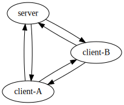

## Introduction and Motivation
I started using `wireguard` some five years ago. Touted as simple and user-friendly, I quickly realized its learning curve was steeper than expected. The labyrinth of networking concepts and system tools seemed like voodoo magic to me. This experience was one of many that steered me towards Rust, a language that promised more clarity in the often murky waters of low-level system networking and programming. While I've grown comfortable with Rust as a system programming language, yet the domain itself remained somewhat mystical. For example, the inner workings of `wireguard` seemed like a well-kept secret, leaving me wondering how it managed to create an alternative Internet and the roles of those `iptables` incatations in its `PostUp`.
My curiosity was reignited when I stumbled upon Jon Gjengset (jonhoo)'s [Implementing TCP in Rust](https://www.youtube.com/watch?v=bzja9fQWzdA) stream. His discussion about the `tun` interface was an eye-opener. Despite years as a web engineer and countless encounters with `wg0`, I was oblivious to this concept. Jonhoo's explanation was a revelation, and suddenly, the pieces began to fall into place.

Motivated by this newfound understanding, I decided to dive deeper into lower-level network programming through a practical approach: creating a simplified version of `wireguard`, focusing on packet routing and bypassing the complexities of security and VPN protocols. Though the project was small, the journey was packed with enlightening moments and intriguing detours. This led to my decision to document the process, naming the project `wontun`.


Before embarking on this adventure, I set some clear goals and boundaries:

* Ultimately `wontun` should reach a stage that is capable of modeling complex peer topologies like `wireguard`.
* Accommodating realistic network conditions and dealing with packet losses and peer restarts is a non-goal, we shall operate in an ideal fantasy land where UDP datagrams are reliably delivered all the time.
* Again, no security, no encryption, which means if you want to play with the code, don't do it over public Internet.
* Concurrency and efficiency should be considered but not optimized for.
* Learning more about Linux network admin and diagnosis tools such as `ip` `iptables` etc. is a side goal.

I could not resist the urge for spoilers and heavily referenced (and sometimes outright stole from) [boringtun](https://github.com/cloudflare/boringtun), a userland Rust implementation of `wireguard`. The overall architecture of `wontun` is modeled after `boringtun`, but greatly simplified and a lot of unsafe code replaced with alternatives either via third-party crates or less efficient but more straight-forward designs. I also took some breaks in between to read some books and theory to help drive key concepts home, a reading list is included in the end.

This project is particularly suited for individuals transitioning from higher-level languages to Rust, keen on system programming but seeking a practical gateway to surmount its entry barriers. Although this article turned out longer than initially planned, I believe its insights will be invaluable, especially for my future self and hopefully others on a similar path.

## The First Step


### Preliminaries: Environment Setup

Before we dive into the heart of our toy VPN application, let's set the stage. Picture this: you've got a shiny VPN application, but how do you know it really works? Testing it in the wilds of the internet is like learning to swim by jumping into the deep end – possible, but probably not a great idea. So, we're going to start by simulating a more controlled environment.

First things first, we need to test our application as if it's running on two separate machines on the same Local Area Network (LAN). Why two machines, you ask? Well, a VPN isn't much of a party if it's just one lonely computer talking to itself. We need a pair to truly test the communication capabilities. Now, unless you have spare computers lying around like socks, setting up multiple machines can be a bit of a headache. Enter Docker, our virtual savior. We'll use Docker containers to mimic separate machines. It's like having a LAN party without needing to invite over your neighbor's computers.


Our setup unfolds as follows: the host machine will play the role of a client, akin to a home computer sitting behind a NAT, initiating the connection to a remote VPN server. This server, running on a public IP address, will be simulated by a Docker container. This container will be equipped with a static IP and an open port, eagerly awaiting VPN traffic. To link these two, we'll craft a Docker network bridge.

Let's start by creating our network:
```bash
docker network create wontun-test
```

To confirm its successful creation, we run:

```bash
> docker network ls

NETWORK ID     NAME          DRIVER    SCOPE
4155cab105dc   host          host      local
de1a447dc1c9   none          null      local
fe67417d0dec   wontun-test   bridge    local
```

A quick peek with the ip command reveals an interesting entry. Notice the interface name `br-fe67417d0dec`, which aligns with the network ID for wontun-test:

```bash
> ip addr show

5: br-fe67417d0dec: <NO-CARRIER,BROADCAST,MULTICAST,UP> mtu 1500 qdisc noqueue state DOWN group default
    link/ether 02:42:86:23:e4:15 brd ff:ff:ff:ff:ff:ff
    inet 172.18.0.1/16 brd 172.18.255.255 scope global br-fe67417d0dec
       valid_lft forever preferred_lft forever
```

Now if we run an image with the `--network=wontun-test`, the container will be reachable from host at the IP address `172.18.0.2` (the host machine will have the ip `172.18.0.1`) We just need to package our server binary into a docker image and run it connected to this network.

Here's the Dockerfile I crafted. It's based on Ubuntu 22.04, mirroring the host operating system. This ensures that we can compile once on the host and seamlessly use the binary inside the container. We'll install a few networking utilities (to be explained later), and copy over the Rust release binary `wontun` and a shell script `run_server.sh` into our image.

```dockerfile
FROM ubuntu:22.04

RUN apt update

RUN apt install -y iproute2 libcap2-bin netcat

COPY target/release/wontun /wontun 

COPY scripts/run_server.sh /run_server.sh

CMD bash run_server.sh
```

### Proof of Concept

In the proof of concept stage, we aim to achieve a few key outcomes:

* A single binary `wontun` is produced that can run both on the client and server (with different command line arguments)
* When both ends are running, a virtual network `10.8.0.1/24` is established between the two hosts

  * The client will have a private IP address `10.8.0.3`
  * The server will have a private IP address `10.8.0.1`
  * We can think of `172.18.0.1` and `172.18.0.2` established previously as their public IP addresses
* The moment of truth will be using `netcat`. If we can successfully run `nc -l 10.8.0.1 80` on the server and the client can connect with `nc 10.8.0.1 80`, we'll know we're on the right track. It's like sending a hello across this newly formed digital world.

```bash
# Terminal tab 1
./scripts/run_client.sh

# Terminal tab 2
docker run --name wontun-remote \
  --rm --network=wontun-test --cap-add=NET_ADMIN \
  --device=/dev/net/tun wontun-remote:latest
  
# Terminal tab 3 (run netcat)
docker exec -it wontun-remote /bin/bash
# inside the container
root@146887094cb9:/# nc -l 10.8.0.1

# Terminal tab 4
nc 10.8.0.1
```

### The Way Packets Flow

Now that we know what we are aiming for, here's a diagram illustrating how we can achieve it.


For those of us not well-versed in the nitty-gritty of Linux network programming, `tun0` jumps out the most and might come off as an arcane term. Here `tun0` is the designation for a virtual network interface within your Linux system. This isn't a physical network card that you can touch but a software-created interface that acts and quacks like a real network device.

The term `tun/tap` refers to two virtual network device drivers that are part of the Linux kernel. `tun` stands for “network TUNnel” and is used to simulate a network layer device, while `tap` stands for “network tap” and simulates a link layer device. In essence, they are virtual network kernels that behave like real network devices from the point of view of your operating system. [Reference material](https://www.kernel.org/doc/Documentation/networking/tuntap.txt). I learned about it through Jon Gjengset (jonhoo)'s excellent [Implementing TCP in Rust](https://www.youtube.com/watch?v=bzja9fQWzdA) stream, which covers `tun/tap` more succinctly and in-depth.

I can attempt to dive deeper into this, but what clicked for me was to jump straight into the code, so let's do that here as well. We'll be leveraging the [`tun-tap`](https://crates.io/crates/tun-tap) crate for this task. Borrowing from the [example code](https://github.com/vorner/tuntap/blob/master/examples/dump_iface.rs) provided by the crate:

```rust
// Create the tun interface.
let iface = Iface::new("testtun", Mode::Tun).unwrap();
eprintln!("Iface: {:?}", iface);
// Configure the „local“ (kernel) endpoint.
cmd("ip", &["addr", "add", "dev", iface.name(), "10.107.1.2/24"]);
cmd("ip", &["link", "set", "up", "dev", iface.name()]);
```

The snippet above spins up a `tun` interface named "testtun". It then uses system commands to assign an IP address and activates the interface.

```rust
println!("You can for example ping 10.107.1.3 (it won't answer)");

let mut buffer = vec![0; 1504];
loop {
    // Every read is one packet. If the buffer is too small, bad luck, it gets truncated.
    let size = iface.recv(&mut buffer).unwrap();
    assert!(size >= 4);
    println!("Packet: {:?}", &buffer[4..size]);
}
```

The `testtun` can be interacted with just like a typical network interface, such as `eth0`. Pinging `10.107.1.3` will dispatch ICMP packets, which our program can intercept using `iface.recv`. Similarly, if there's a service listening on `10.107.1.2`—let's say an HTTP server on port `80`—sending a properly crafted IP packet to `10.107.1.2:80` will be correctly routed to the service.

If you're familiar with VPNs like `wireguard`, the `wg0` interface that `wg-quick` conjures up is actually a `tun` interface.

Now that we're equipped to capture raw IP packets from `tun0`, which are merely bytes, our next move is to wrap these bytes in a custom VPN protocol, packaging each into a UDP datagram. Initially, our encapsulation approach is straightforward: we simply forward the IP packets without alteration, directly to the server. On the wire, the IP packet structure resembles:

```text
+---------------------------------------+                    
|    +---------------------------------+|                    
|    |     +--------------------------+||                    
| IP |UDP  |IP                        |||                    
|    |     +--------------------------+||                    
|    +---------------------------------+|                    
+---------------------------------------+ 
```

Adding this entails an extra 28 bytes of overhead due to the IP and UDP headers. If the route from client to server has an MTU (Maximum Transmission Unit) of 1500 bytes—a common default—trying to send an original IP packet of 1500 bytes will cause fragmentation, which is usually best avoided. To tackle this, we can set the `tun0` interface's MTU to a lower value, akin to `wireguard` which defaults to 1420:

```bash
ip link set dev tun0 mtu 1472
```

By doing so, we ensure that packets received from `tun0` will be at most 1472 bytes, thus avoiding fragmentation.

The reverse happens on the server: incoming UDP datagrams are unwrapped, the original IP packets are written to the `tun0` interface on the server by calling `iface.send`.

### Basic Types

Now, we roll up our sleeves and start coding. First off, we'll lay out our starter types:

```rust
use std::net::{SocketAddrV4, UdpSocket};
use tun_tap::Iface;
use parking_lot::Mutex;

pub struct Peer {
    endpoint: Mutex<Option<SocketAddrV4>>,
}

pub struct Device {
    udp: UdpSocket,
    iface: Iface,
    peer: Peer,
}
```

We'll be utilizing our friend `Iface` from the `tun-tap` crate, which, as we've discussed, represents a virtual network interface. The `Device` struct is our central entity for managing IP traffic tunneling. Unlike `wireguard`, which permits defining multiple peers per host and supports complex network configurations, our model will be more straightforward, with one peer per host.

A `Peer` for now is just a wrapper around its endpoint, which is an `Option<SocketAddrV4>` (we will be supporting IPv4 only). The address is also wrapped in a `Mutex` - this is a hint that we will be running this application in multiple threads.

To explain why `endpoint` is an `Option`, on the server side, our VPN application boots up without knowledge of its peer's IP address. This mirrors common real-world VPN scenarios where the server has a known public IP, but the client IPs, often home computers, are dynamically assigned by ISPs and not static. Consequently, clients must initiate the contact. When the server receives incoming connection attempts from clients (in our minimal setup, a single client), it responds and decides whether to authorize or reject these connections. Only after this handshake does a steady state emerge, with both the client and server aware of each other's addresses, allowing for the free flow of data packets.

### Two main loops

The core logic of our application revolves around two essential loops:

1. The first loop listens for packets from the `iface` and forwards them to the `peer` using the associated `UdpSocket`.
2. The second loop listens on the `UdpSocket` for incoming packets and forwards them to the `iface`.

These loops are the heartbeats of our VPN tunnel, handling the bidirectional flow of data:

```rust
impl Device {
    fn loop_listen_iface(&self) -> io::Result<()> {
        // a large enough buffer, recall the MTU on iface was to be set to 1472
        let mut buf = [0u8; 1504];
        loop {
            let nbytes = self.iface.recv(&mut buf[..])?;
            let peer = self.peer.endpoint();
            if let Some(peer_addr) = peer.as_ref() {
                self.udp.send_to(&buf[..nbytes], peer_addr)?;
            } else {
                eprintln!("..no peer");
            }
        }
    }
}
```

The loop listening on the `iface` is straightforward: we read packets from the virtual interface and forward them to the peer's address if it's known. If we don't have a peer address, it's logged for troubleshooting.

```rust
impl Device {
    fn loop_listen_udp(&self) -> io::Result<()> {
        let mut buf = [0u8; 1504];
        loop {
            let (nbytes, peer_addr) = self.udp.recv_from(&mut buf[..])?;
            if let SocketAddr::V4(peer_addr_v4) = peer_addr {
                self.peer.set_endpoint(peer_addr_v4);
                self.iface.send(&buf[..nbytes])?;
            }
        }
    }
}
```

The listening loop on the `udp` socket has a nuanced role. Whenever a packet is received, the sender's address (`peer_addr`) is captured. This address is crucial as it determines where to send the reply packets. Using the `set_endpoint` method, we update the peer's endpoint only if it hasn't been set before. This allows the server to dynamically learn about its client's address, reflecting the typical behavior of a VPN server where clients may have dynamic IP addresses. The implementation of `set_endpoint` included below.

```rust
impl Peer {
    fn endpoint(&self) -> MutexGuard<Option<SocketAddrV4>> {
        self.endpoint.lock()
    }

    fn set_endpoint(&self, addr: SocketAddrV4) {
        let mut endpoint = self.endpoint.lock();
        if endpoint.is_none() {
            *endpoint = Some(addr);
        }
    }
}
```


In the networking kingdom, our server mimics a hatchling imprinting on the first creature it sees, treating the first IP address that comes knocking as its trusted source. It's a charming "love at first packet" approach.

However, this method lacks discretion, much like a gosling mistaking a bouncing ball for its parent. To prevent our server from naively trusting any stray data packet that wanders by, we'll need to implement a handshake protocol... by requesting the client to say `hello?` first:

```rust
impl Device {
    fn loop_listen_iface(&self) -> io::Result<()> {
        // a large enough buffer, recall the MTU on iface was to be set to 1472
        let mut buf = [0u8; 1504];
        {
            let peer = self.peer.endpoint();
            if let Some(peer_addr) = peer.as_ref() {
                eprintln!("initiating \"handshake\" to peer: {peer_addr}");
                self.udp.send_to("hello?".as_bytes(), peer_addr)?;
            }
        }
        loop {
            // omitted
        }
    }
    
    fn loop_listen_udp(&self) -> io::Result<()> {
        let mut buf = [0u8; 1504];
        loop {
            let (nbytes, peer_addr) = self.udp.recv_from(&mut buf[..])?;
            if let SocketAddr::V4(peer_addr_v4) = peer_addr {
                if &buf[..nbytes] == b"hello?" {
                    eprintln!("\"handshake\" received");
                    self.peer.set_endpoint(peer_addr_v4);
                    continue;
                }
                self.iface.send(&buf[..nbytes])?;
            }
        }
    }
}
```

### Put it All Together

Behold, our `main.rs`:

```rust
#[derive(Parser)]
#[clap(author, version, about, long_about = None)]
struct Cli {
    #[arg(long)]
    peer: Option<String>,
}

fn run(peer_addr: Option<&str>) -> io::Result<()> {
    let iface = tun_tap::Iface::without_packet_info("tun0", tun_tap::Mode::Tun)?;

    let peer = peer_addr
        .and_then(|addr| addr.parse::<SocketAddr>().ok())
        .and_then(|addr| {
            if let SocketAddr::V4(addr) = addr {
                Some(addr)
            } else {
                None
            }
        });

    let dev = Device::new(iface, peer);
    
    let dev1 = Arc::new(dev);
    let dev2 = Arc::clone(&dev1);

    let jh1 = std::thread::spawn(move || {
        if let Err(err) = dev1.loop_listen_iface() {
            eprintln!("err loop 1: {:?}", err);
        }
    });
    let jh2 = std::thread::spawn(move || {
        if let Err(err) = dev2.loop_listen_udp() {
            eprintln!("err loop 2: {:?}", err);
        }
    });

    jh1.join().unwrap();
    jh2.join().unwrap();

    Ok(())
}

fn main() -> Result<(), Box<dyn std::error::Error>> {
    println!("Start!");
    let args = Cli::parse();
    run(args.peer.as_deref())?;

    Ok(())
}
```

The code above sets up a virtual network interface `tun0` and parses the command-line arguments to determine if the program should run in client mode (with a peer) or server mode (without a peer). Two threads are spawned: one to manage data received from the virtual interface, and another to handle incoming UDP packets. Error handling is in place to log any issues encountered during execution.

For the grand finale, we roll out the red carpet with a pair of bash scripts:

```bash
#!/bin/bash

# This is run_client.sh

sudo setcap cap_net_admin=eip target/release/wontun
target/release/wontun --peer 172.18.0.2:19988 &
pid=$!

sudo ip addr add 10.8.0.3/24 dev tun0
sudo ip link set up dev tun0
sudo ip link set dev tun0 mtu 1400

trap "kill $pid" INT TERM
wait $pid

```

```bash
#!/bin/bash

# This is run_server.sh

setcap 'cap_net_admin=eip'  ./wontun

./wontun &
pid=$!

ip addr add 10.8.0.1/24 dev tun0
ip link set up dev tun0
ip link set dev tun0 mtu 1400


trap "kill $pid" INT TERM

wait $pid
```

These scripts are the glue that binds our code to the system, setting the required `cap_net_admin` capability which is necessary for manipulating `tun` interfaces. The server script kicks off `wontun` without specifying a peer, making it ready to accept any incoming client. In contrast, the client script tells `wontun` exactly where to find its server peer, in this case at `172.18.0.2:19988`. Both scripts prepare the `tun0` interface with appropriate IP configurations, client at `10.8.0.3` and the server at `10.8.0.1`.

Final note, running `run_server.sh` inside docker operates in a more restrictive environment. We need to explicitly pass the `--cap-add=NET_ADMIN` and `--device=/dev/net/tun` flags to enable `tun` interfaces inside the container:

```bash
docker run --name wontun-remote \
  --rm --network=wontun-test --cap-add=NET_ADMIN \
  --device=/dev/net/tun wontun-remote:latest
```

Now running the commands provided in the beginning of this section, we can make the machines talk to each other over our makeshift, horribly insecure VPN!

```bash
root@2b97a5406ec2:/# nc -l 10.8.0.1 80
Hello?
World!

host> nc 10.8.0.1 80
Hello?
World!
```

A checkpoint of `wontun` can be browsed at: [Github link](https://github.com/yiransheng/wontun/tree/608ef9b71be486398bfca1662926fdc80a7d2901)

## Let's Epoll

With a proof of concept implemented, we are now ready to move on for some architecture improvements. Our end goal is to support a multitude of peers and intricate routing mechanisms (like `wireguard`).  To accomplish that, the VPN application likely needs to manage an unbounded set of UDP connections (there will still be only one `tun` interface however). The current implementation, spawning two threads per peer, is charmingly simple but, let's face it, not quite fit for the big leagues in terms of scalability. Enter `epoll` and non-blocking IO—our tools of choice for the next phase. We will not be changing the application's behavior just yet, instead our goal is to replace the two main loops with a single `epoll` backed event loop.

### Quick Preview

We will cover the following topics in this section:

* How `epoll` works and how to use it
* More about the capacities and behaviors of `UdpSocket`, particularly `SO_REUSEADDR` / port reuse
* Some preparations to make our central `Device` type thread safe, but the main loop will remain single-threaded for now

Here's a sneak peek at what our new and improved main loop will look like:
```rust
pub fn wait(&self) {
    let mut t = ThreadData {
        src_buf: [0; BUF_SIZE],
    };

    while let Ok(token) = self.poll.wait() {
        match token {
            Token::Tun => {
                if let Err(err) = self.handle_tun(&mut t) {
                    eprintln!("tun error: {:?}", err);
                }
            }
            Token::Sock(SockID::Disconnected) => {
                if let Err(err) = self.handle_udp(&self.udp, &mut t) {
                    eprintln!("udp error: {:?}", err);
                }
            }
            Token::Sock(SockID::ConnectedPeer) => {
                if let Some(conn) = self.peer.endpoint().conn.as_deref() {
                    if let Err(err) = self.handle_connected_peer(conn, &mut t) {
                        eprintln!("udp error: {:?}", err);
                    }
                }
            }
        }
    }
}

```

 Without supplying to you further details, a few key observations:

* This code is modeled after [ `mio`](https://crates.io/crates/mio) apis
* The `match` is exhaustive, vaguely indicating we are managing three file descriptors, based on naming: a `tun` interface, a pair of connected and disconnected UDP sockets
* The name `ThreadData` foreshadows our intention to run this `wait` loop in multiple threads concurrently

### Epoll Basics

`epoll` is an IO event notification facility in Linux, designed to efficiently monitor multiple file descriptors. It's especially useful in applications where you need to handle numerous simultaneous socket connections.

At its core, `epoll` operates using three main system calls:

1. **epoll_create**: This call creates an `epoll` instance and returns a file descriptor associated with it. This descriptor is used in subsequent `epoll` calls and should be closed with `close()` when no longer needed.
2. **epoll_ctl**: This is used to add, modify, or remove file descriptors from the `epoll` instance. It's through this call that you specify the events you are interested in for each file descriptor. For instance, you might want to know when data is ready to be read (`EPOLLIN`).
3. **epoll_wait**: This call waits for events on the `epoll` file descriptor. When an event occurs, `epoll_wait` returns, providing information about the event and the associated file descriptor.

The `epoll` [man page](// https://man7.org/linux/man-pages/man7/epoll.7.html) is fairly comprehensive and relatively easy to follow, please give it a read.

### Understanding `epoll_event`

In applications using `epoll`, a central event loop continuously calls `epoll_wait` to monitor for events. When an event occurs, such as a `UdpSocket` becoming readable, the application executes relevant non-blocking IO operations on the corresponding file descriptor.

The event data in `epoll` is encapsulated in a `struct epoll_event`, which contains two key pieces of information:

1. **epoll_event.event**: This field holds the `epoll` flags, which signal the type of event. Common flags include `EPOLLIN` for readability and `EPOLLOUT` for writability of a file descriptor.
2. **epoll_event.data**: This is a user-defined `u64` value, set during the `epoll_ctl` call and returned by `epoll_wait`. It helps the application identify which file descriptor or resource the event is associated with.

### Handling Callbacks in Rust

Traditionally, in languages like C, the `epoll_event.data` is often used to store a pointer to a callback function that should be executed in response to the event. However, in Rust, this approach would require unsafe code to cast a `Box<dyn FnMut(_)>` to and from a `u64`, which can be risky and complex.

To avoid unsafe code, our `wontun` application will utilize a tailor-made `Token` type that can be safely encoded into and decoded from a `u64`. This `Token` will help us identify which socket has become active and determine the appropriate handler function to execute. This approach avoids `unsafe` code while providing the flexibility needed for event handling.

Finally, for sending data through `UdpSocket` and `Iface`, it's worth noting that these operations are generally non-blocking. To keep our implementation straightforward, we will register only read interests (`EPOLLIN`) with `epoll`. Consequently, data sending will occur directly within the read handlers, simplifying the logic and avoiding the need for managing writable state or additional `epoll` flags for output operations. This choice helps streamline the event handling process, focusing on efficiently managing incoming data and responding promptly.

### The `Poll` Wrapper

We introduce the `Poll` wrapper, a crucial component for managing `epoll` interactions more effectively. We utilize the `nix` crate, which provides a safe interface to the underlying `epoll` system calls in Linux. The wrapper we build around `nix::sys::epoll::Epoll` is designed to simplify our interactions with `epoll`.

```rust
use std::io;
use std::os::fd::AsFd;

use nix::sys::epoll::{Epoll, EpollCreateFlags, EpollEvent, EpollFlags};

#[derive(Debug, Copy, Clone, Eq, PartialEq)]
pub enum Token<ID = i32> {
    Tun,
    Sock(ID),
}

#[derive(Debug, Copy, Clone, Eq, PartialEq)]
pub struct UnknownToken;

impl<ID> From<Token<ID>> for u64
where
    ID: Into<i32>,
{
    fn from(value: Token<ID>) -> Self {
        match value {
            Token::Tun => 1 << 32,
            Token::Sock(sock_index) => 2 << 32 | (sock_index.into() as u32 as u64),
        }
    }
}

impl<ID> TryFrom<u64> for Token<ID>
where
    ID: From<i32>,
{
    type Error = UnknownToken;

    fn try_from(value: u64) -> Result<Self, Self::Error> {
        let tag = value >> 32;
        let token = match tag {
            1 => Token::Tun,
            2 => Token::Sock((value as i32).into()),
            _ => return Err(UnknownToken),
        };

        Ok(token)
    }
}

const EPOLL_FLAGS: EpollFlags = EpollFlags::EPOLLIN.union(EpollFlags::EPOLLET);

pub struct Poll {
    epoll: Epoll,
}

impl Poll {
    pub fn new() -> io::Result<Self> {
        let epoll = Epoll::new(EpollCreateFlags::EPOLL_CLOEXEC)?;
        Ok(Self { epoll })
    }

    pub fn register_read<F: AsFd, ID: From<i32> + Into<i32>>(
        &self,
        token: Token<ID>,
        fd: &F,
    ) -> io::Result<()> {
        let event = EpollEvent::new(EPOLL_FLAGS, token.into());
        self.epoll.add(fd, event)?;

        Ok(())
    }

    pub fn delete<F: AsFd>(&self, fd: &F) -> io::Result<()> {
        self.epoll.delete(fd)?;

        Ok(())
    }

    pub fn wait<ID: From<i32> + Into<i32>>(&self) -> io::Result<Token<ID>> {
        let mut events = [EpollEvent::empty()];

        let n = self.epoll.wait(&mut events, -1)?;
        assert!(n == 1);

        let data = events[0].data();
        let token = Token::try_from(data)
            .map_err(|_| io::Error::new(io::ErrorKind::Other, "unexpected epoll data"))?;

        Ok(token)
    }
}
```

As you can tell, there isn't all that much going on. We just wrap the original `new`, `add`, `delete` and `wait` methods with trivial type conversions added. The small customizations are:

* In `wait`, wait for one event at a time (`epoll_wait` sys call can return a list of ready events using the out parameter pattern through the`&mut events` argument)
* Use a `Token` type for event identification as explained previously


### Revised `Device` Type

It's time for the core types from the first section to get an upgrade:

```rust
pub struct Device {
    udp: Arc<UdpSocket>,
    iface: Iface,
    peer: Peer,
    poll: Poll,

    use_connected_peer: bool,
    listen_port: u16,
}

pub struct Peer {
    endpoint: RwLock<Endpoint>,
}

#[derive(Default)]
pub struct Endpoint {
    pub addr: Option<SocketAddrV4>,
    pub conn: Option<Arc<UdpSocket>>,
}

```

Some key changes:

1. **Incorporating `Poll`**: The `Device` now includes a `Poll` instance, allowing it to interact efficiently with the `epoll` mechanism.
2. **Enhanced Endpoint Type**: Previously, an endpoint was simply represented as an `Option<SocketAddrV4>`. Now, it's a full-fledged `Endpoint` struct, accommodating an additional field `conn: Option<Arc<UdpSocket>>`.
3. **Use of Arc and RwLock**: The introduction of `Arc` (Atomic Reference Counting) and `RwLock` (Read-Write Lock) indicates a shift towards thread-safe operations. 

The big picture idea is the concept of using a "connected peer". This applies to `wontun` on the server side. Previously, we used a single `UdpSocket` for receiving and sending data, this is possible because `UdpSocket`s are connectionless. Now, once a client peer connects to the server, we shall open a new `UdpSocket` and connect it to the client's (public) IP address and port.

In networking, UDP sockets can operate in two modes: connected and disconnected (or bind-only).

- **Disconnected/Bind-Only UDP Sockets**: These are the traditional form of UDP sockets. They are not connected to a specific remote address. Instead, each IO operation on the socket requires specifying the target address for sending data. This mode is flexible as it allows a single socket to communicate with multiple peers, but it requires the application to manage the mapping between messages and their destinations or sources.
- **Connected UDP Sockets**: When a UDP socket is "connected" to a specific remote address and port, it can **only send to and receive from that particular address**. This restriction simplifies the IO operations since the target/source address need not be specified with each operation. For `wontun` on the server side, this approach means that once a client establishes a connection, the server opens a new, dedicated UDP socket connected to the client's public IP and port. This setup streamlines communication with individual clients, once we start introducing more peers into the system, this setup would greatly simply state management and packet routing.

In conclusion, now for each `Device` instance, there will be three IO resources in the loop: the `tun` interface, a disconnected `UdpSocket` to handle the initial client handshake, and a connected peer `UdpSocket` to transmit subsequent data packets over.

### Port Reuse

With the introduction of a second `UdpSocket` in our system, we encounter a challenge: we have only one port available for listening. Attempting to bind another `UdpSocket` to this same port would normally result in an `EADDRINUSE` IO error. A solution exists in the form of port reuse, enabled by the `SO_REUSEADDR` socket option.

`SO_REUSEADDR` is a socket option that influences how the underlying operating system manages socket bindings, particularly regarding address and port reuse. System Calls Associated with `SO_REUSEADDR`:

1. **setsockopt**: This is the primary system call used to enable the `SO_REUSEADDR` option on a socket. It's used to set options at the socket level and is called after socket creation but before binding the socket to an address with `bind`.
2. **bind**: This system call assigns a local protocol address to a socket. With `SO_REUSEADDR` enabled, the `bind` call allows a new socket to be bound to a port already in use by another socket.

The standard Rust `UdpSocket` library doesn't directly support `SO_REUSEADDR`, so we turn to the [`socket2`](https://crates.io/crates/socket2) crate for this functionality. Here's how it's done:

```rust
fn new_udp_socket(port: u16) -> io::Result<UdpSocket> {
    let socket_addr = SocketAddr::from(([0, 0, 0, 0], port));

    let socket = Socket::new(Domain::IPV4, Type::DGRAM, Some(Protocol::UDP))?;

    socket.set_reuse_address(true)?;
    socket.set_nonblocking(true)?;

    socket.bind(&socket_addr.into())?;

    Ok(socket.into())
}

impl Peer {
    fn connect_endpoint(&self, port: u16) -> io::Result<Arc<UdpSocket>> {
        let mut endpoint = self.endpoint.write();
        let addr = endpoint.addr.unwrap();

        assert!(endpoint.conn.is_none());

        let conn = new_udp_socket(port)?;
        conn.connect(addr)?;
        let conn = Arc::new(conn);

        endpoint.conn = Some(Arc::clone(&conn));

        Ok(conn)
    }
}
```

Note there's a modern alternative to `SO_REUSEADDR` in Linux kernel >=3.9 that is `SO_REUSEPORT`, which does a bit more magic:

> For UDP sockets, it tries to distribute datagrams evenly, for TCP listening sockets, it tries to distribute incoming connect requests (those accepted by calling `accept()`) evenly across all the sockets that share the same address and port combination.

Source: https://stackoverflow.com/questions/14388706/how-do-so-reuseaddr-and-so-reuseport-differ

The `socket2`'s `set_reuse_address` api supports `SO_REUSEADDR` only. If desired, we can invoke `setsockopt` sys call on the `socket2::Socket`'s file descriptor directly. For now `SO_REUSEADDR` will do, we just need to make sure our handlers for either `UdpSocket` can handle incoming datagrams correctly.

### The Startup and the Handlers

```rust
pub fn start(&self) -> io::Result<()> {
    self.poll
        .register_read(Token::Sock(SockID::Disconnected), self.udp.as_ref())?;

    let tun_fd = unsafe { BorrowedFd::borrow_raw(self.iface.as_raw_fd()) };
    self.poll.register_read::<_, SockID>(Token::Tun, &tun_fd)?;

    self.initiate_handshake()
}
```

Upon initialization, the `Device` is configured with a listening `UdpSocket` (`self.udp`) and a `tun` interface (`self.iface`). Both of these are registered with the `epoll` instance (`self.poll`) to monitor for readable events. This setup ensures that our application is immediately ready to handle incoming data on both the `tun` interface and the UDP socket.

The handler for reading from `self.iface` is similar to the code we had at POC stage (it is helpful to refer back to the [event loop](#quick-preview) shown earlier for details on how we call this handler): 

```rust
fn handle_tun(&self, thread_data: &mut ThreadData) -> io::Result<()> {
    let buf = &mut thread_data.src_buf[..];
    while let Ok(nbytes) = self.iface.recv(buf) {
        let endpoint = self.peer.endpoint();
        // ignore send errors
        let _send_result = if let Some(ref conn) = endpoint.conn {
            conn.send(&buf[..nbytes])
        } else if let Some(ref addr) = endpoint.addr {
            self.udp.send_to(&buf[..nbytes], addr)
        } else {
            Ok(0)
        };
    }

    Ok(())
}
```

If our peer is connected, we prefer to send data over the connected `UdpSocket`. Otherwise, we will use the main listening socket `self.udp` and a `send_to` call.

Handling incoming data from a connected peer's `UdpSocket` is also straightforward:

```rust
fn handle_connected_peer(
    &self,
    sock: &UdpSocket,
    thread_data: &mut ThreadData,
) -> io::Result<()> {
    let buf = &mut thread_data.src_buf[..];
    while let Ok(nbytes) = sock.recv(&mut buf[..]) {
        let _ = self.iface.send(&buf[..nbytes]);
    }

    Ok(())
}
```

Handling incoming data from the default, disconnected socket is a bit more involved:

```rust
fn handle_udp(&self, sock: &UdpSocket, thread_data: &mut ThreadData) -> io::Result<()> {
    let buf = &mut thread_data.src_buf[..];
    while let Ok((nbytes, peer_addr)) = sock.recv_from(&mut buf[..]) {
        if let SocketAddr::V4(peer_addr_v4) = peer_addr {
            if &buf[..nbytes] == b"hello?" {
                eprintln!("received handshake..");

                let (endpoint_changed, conn) = self.peer.set_endpoint(peer_addr_v4);
                if let Some(conn) = conn {
                    self.poll.delete(conn.as_ref()).expect("epoll delete");
                    drop(conn);
                }

                if endpoint_changed && self.use_connected_peer {
                    match self.peer.connect_endpoint(self.listen_port) {
                        Ok(conn) => {
                            self.poll
                            .register_read(Token::Sock(SockID::ConnectedPeer), &*conn)
                            .expect("epoll add");
                        }
                        Err(err) => {
                            eprintln!("error connecting to peer: {:?}", err);
                        }
                    }
                }
                continue;
            }
            let _ = self.iface.send(&buf[..nbytes]);
        }
    }

    Ok(())
}
```

The primary task here is to manage the handshake process, marked by a simple "hello?" message. The function retrieves the client's IP address and updates the peer endpoint accordingly. If the application is configured to use a connected socket (`self.use_connected_peer`), it establishes a new connected `UdpSocket` for the peer, enhancing the efficiency of the communication channel. Key points:

* The `recv_from` call captures the client's address (`peer_addr_v4`), enabling the server to respond appropriately. 
* Next, the call to `self.peer.set_endpoint` update's the peer endpoint address, and returns if it had a different address and a previous connected `UdpSocket` is any.
  * This is the reason we introduced a `RwLock` in `Peer.endpoint`, we need write access to `&self.peer` here, accommodating dynamic changes in the connected client's address.
  * If a prior `endpoint.conn` exists, we remove it from the `epoll` set and `drop` it.
* If the device is configured to use connected socket (`self.use_connected_peer`), we create a connected `UdpSocket` (returned from `peer.connect_endpoint` call), reusing the same listening port configured on the device.
  * And we add this newly created `UdpSocket` to `self.epoll` set.
  * Note we use a `Token::Sock(SockID::ConnectedPeer)` to register the read interest, to distinguish from the `Token::Sock(SockID::Disconnected)` for the default listening `UdpSocket` registered in startup code (`start` method).

### That's all and the Final Code

```rust
impl Device {
    pub fn new(config: DeviceConfig) -> io::Result<Self> {
        // ... omitted
    }

    pub fn wait(&self) {
        let mut t = ThreadData {
            src_buf: [0; BUF_SIZE],
        };

        while let Ok(token) = self.poll.wait() {
            match token {
                Token::Tun => {
                    if let Err(err) = self.handle_tun(&mut t) {
                        eprintln!("tun error: {:?}", err);
                    }
                }
                Token::Sock(SockID::Disconnected) => {
                    if let Err(err) = self.handle_udp(&self.udp, &mut t) {
                        eprintln!("udp error: {:?}", err);
                    }
                }
                Token::Sock(SockID::ConnectedPeer) => {
                    if let Some(conn) = self.peer.endpoint().conn.as_deref() {
                        if let Err(err) = self.handle_connected_peer(conn, &mut t) {
                            eprintln!("udp error: {:?}", err);
                        }
                    }
                }
            }
        }
    }

    pub fn start(&self) -> io::Result<()> {
        // omitted...
    }
    
    fn handle_tun(&self, thread_data: &mut ThreadData) -> io::Result<()> {
        // omitted...
    }

    fn handle_connected_peer(
        &self,
        sock: &UdpSocket,
        thread_data: &mut ThreadData,
    ) -> io::Result<()> {
        // omitted...
    }
    
    fn handle_udp(&self, sock: &UdpSocket, thread_data: &mut ThreadData) -> io::Result<()> {
        // omitted...
    }
    
    fn initiate_handshake(&self) -> io::Result<()> {
        let msg = b"hello?";

        let endpoint = self.peer.endpoint();
        if let Some(ref conn) = endpoint.conn {
            conn.send(msg)?;
        } else if let Some(ref addr) = endpoint.addr {
            self.udp.send_to(msg, addr)?;
        };

        Ok(())
    }
}
```

```rust
fn run(peer: Option<SocketAddrV4>) -> io::Result<()> {
    let conf = DeviceConfig::new(
        /* use_connected_peer: */ peer.is_none(),
        /* listen_port: */ 19988, 
        /* tun_name: */ "tun0",
        /* peer_addr: */ peer
    );

    let dev = Device::new(conf)?;
    dev.start()?;
    dev.wait();

    Ok(())
}
```

Use the same setup and shell scripts as [before](#put-it-all-together), we can verify things are still in working condition. We have successfully refactored `wontun` to use `epoll` and connected sockets. A checkpoint of `wontun` can be browsed at: [Github link](https://github.com/yiransheng/wontun/tree/a6a5306c4f91203713c52736f29caa474083a8fe).

## Many Peers

As our VPN application grows from a cozy duet to a bustling network of connections, we're gearing up to adjust our codebase to support multiple peers efficiently. This transition is not just about scaling up; it's about introducing a level of sophistication and flexibility that allows seamless communication across an expanded network. Our primary goal is to rework the existing structures and logic to cater to a dynamic environment where numerous peers interact. This means enhancing our routing mechanisms, refining how we handle incoming and outgoing packets, and ensuring that each peer is uniquely identifiable and properly managed. By doing so, we'll transform our application from a simple point-to-point tunnel into a versatile, multi-peer VPN, ready to handle a diverse range of connections and networking scenarios.

### Project Overview

A little bit of house keeping upfront. Up until this point, we have been putting everything inside `lib.rs`. It's time to factor out various building blocks, roughly into their respective types and purposes. This is the new file structure under `src`:

```text
src/
├── allowed_ip.rs
├── conf.rs
├── dev.rs
├── lib.rs
├── packet.rs
├── peer.rs
├── poll.rs
├── udp.rs
├── wontun-conf.rs
└── wontun.rs

0 directories, 10 files
```

* `wontun.rs` is our main binary entry point.
* `wontun-conf.rs` is an auxiliary binary that parses configuration files in `ini` format and dump them into `json` (which then can be manipulated easily with `jq` in shell scripts).
* `conf.rs` defines a configuration format and implements parsing from `ini`. The supported options are a subset of `wireguard` configurations format.
* `poll.rs` is our `Poll` wrapper from before, and will remain unchanged in this section.
* `udp.rs` contains a single helper function `new_udp_socket` from last section.
* `dev.rs` and `peer.rs` corresponds to our familiar `Device` and `Peer` types, which of course will be going through some changes.
* `packet.rs` and `allowed_ips.rs` are new modules that will be covered in details soon.

### Peer Identities

When the world contains all but two entities, there are no need for names. The pronouns "you" and "me" are enough for the pair to refer to each other. This was the situation when we restricted our VPN to allow only one peer per host. On either machine, any bytes coming from the `tun` interface was unambiguously meant for "you", the singular partner in our lonely VPN network.

As we invite more participants to our VPN party, a clear system of identification becomes evident. `wireguard` identifies peers by their `PublicKey`s, we will simply use string names - shamelessly transmitted over the wire in plain texts. 

**Configuration Examples**

Consider three hosts, `A`, `B`, and `C`. Their configurations might look like this:

Configuration on `A`:

```ini
[Interface]
Name=A

[Peer]
Name=B

[Peer]
...
```

Configuration on `B`:

```ini
[Interface]
Name=B

[Peer]
Name=C

[Peer]
Name=A
```

Configuration on `C`:

```ini
[Interface]
Name=C

[Peer]
Name=B
```
**Interesting note**: the `Name` field is supported by `wireguard`, but ignored entirely, it exists only as a form of documentation.

The names are global and all hosts agree on their meanings. If, for example, each host stores a `HashMap<PeerName, Peer>` at runtime, and every packet transmitted over UDP includes the name of the sender, it would be fairly straightforward to route the packets. However, including a potentially long name in every data packet transmitted is just too wasteful, we opt to use a slightly more complicated system, and tag each message with a `u32` index.

Each host configures its peers and assigns a `local_index` at startup, effectively placing each peer at a specific position in a `Vec<Peer>`. But there's a catch: peers initially don't know their `local_index` as seen by others. For instance, host `B` might be `local_index=9` in `A`'s list, but `B` itself starts unaware of this numeric label.

For this reason, we shall store another index in `struct Peer`, called `remote_index`.  At the steady state, the `Device` on node `B` would have the following data:

```rust
Deivice {
    name: "B",
    peers: vec![
        Peer {
            name: "A",
            // This peer is the 0'th element in peers Vec
            local_index: 0,
            remote_index: 9,
        }
    ]
}
```

On node `A`:

```rust
Device {
    name: "A",
    peers: vec![
        //...
        Peer {
            name: "B",
            // This peer is the 9'th element in peers Vec
            local_index: 9,
            remote_index: 0,
        }
    ]
}
```
This relationship between `local_index` and `remote_index` is further clarified/illustrated below:


Another interesting note on `wireguard`, it obfuscates the indices used in its packets by randomizing them into a 24 bit address space, hiding the total number of peers using the system. Since security is absolutely not a concern for us, we keep it simple and attempt no such obfuscation.

Alright, now we can state our first problem: design a handshake protocol to establish `remote_index` values  satisfying:

* `A.peer(name=B).local_index == B.peer(name=A).remote_index`
* `A.peer(name=B).remote_index == B.peer(name=A).local_index`

However, we will not tackle it right away, instead let's explore the problem space a little bit more and talk about:

### The Dual Purposes of `AllowedIPs`

As we have learned, the heart of a VPN application is handling communications in two directions: `tun -> udp`and `udp -> tun`. Consider the first direction in a multi-peer setting, when an IP packet is extracted from the `tun` interface, we face a decision: to which `Peer` should this packet be sent? The answer lies in inspecting the packet's [IP header](https://en.wikipedia.org/wiki/Internet_Protocol_version_4#Packet_structure), specifically its destination address.

This is the first purpose of `AllowedIPs`. This is a new concept to us, but an essential configuration component in `wireguard`. `AllowedIPs` is a list of CIDR notations associated with each peer, defining a range of IP addresses that the peer is responsible for. The routing logic involves checking the packet's destination address (`dst`) against the `AllowedIPs` of each `Peer`. The packet is sent to the `Peer` whose `AllowedIPs` range includes `dst`. In cases where multiple peers match, the one with the longest prefix match is selected.

Conversely, for incoming UDP datagrams, after decapsulation, we obtain an IP packet with a known source address (`src`). Given the connected `Peer` from which this packet originates, we check if `src` falls within that peer's `AllowedIPs`. If it does, the packet is forwarded to the `tun` interface; if not, it's dropped. This step ensures that only packets from valid sources are processed and forwarded.

In our code base, the `AllowedIPs` is represented by the following type (interface only, implementation omitted):

```rust
pub struct AllowedIps<D> {
    
}

impl<D> AllowedIps<D> {
    pub fn new() -> Self {
        
    }

    pub fn clear(&mut self) {

    }

    pub fn insert(&mut self, key: IpAddr, cidr: u8, data: D) -> Option<D> {

    }

    pub fn get(&self, key: IpAddr) -> Option<&D> {

    }

    pub fn remove(&mut self, predicate: &dyn Fn(&D) -> bool) {

    }

    pub fn iter(&self) -> Iter<D> {

    }
}

```

Well, a confession: I straight up stole it from [`boringtun`](https://github.com/cloudflare/boringtun/blob/f672bb6c1e1e371240a8d151f15854687eb740bb/boringtun/src/device/allowed_ips.rs), which uses an efficient trie-based lookup table from the crate [`ip_network_table`](https://crates.io/crates/ip_network_table).

This structure and its methods provide the necessary functionality to manage the `AllowedIPs` configurations for each peer. It includes operations for inserting new ranges, querying for a specific IP address, and iterating over all entries. The generic parameter `D` allows for associating additional data with each CIDR range, providing flexibility in how `AllowedIPs` is utilized in the broader context of the application.

To summarize, `AllowedIPs` in our VPN application achieves two key objectives:

1. **Peer Selection for Outgoing Packets**: Determines which peer an outgoing IP packet should be routed to based on its destination address.
2. **Source Address Filtering for Incoming Packets**: Ensures that incoming packets are from an allowed source before forwarding them to the `tun` interface.

And we are ready to state our second problem: `Peer` selection for IO events on both `tun` and `UdpSocket`s, which we will address first in the next sub-section.

### `Peer` Selection

For outgoing traffic, we make the following changes to our `Device` type:

```rust
struct Device {
    // ...
    peers_by_ip: AllowedIps<Arc<Peer>>,
}
```

In `handle_tun`:

```rust
fn handle_tun(&self, thread_data: &mut ThreadData) -> io::Result<()> {
    let src_buf = &mut thread_data.src_buf[..];
    while let Ok(nbytes) = self.iface.recv(src_buf) {
        let (src, dst) = match etherparse::Ipv4HeaderSlice::from_slice(&src_buf[..nbytes]) {
            Ok(iph) => {
                let src = iph.source_addr();
                let dst = iph.destination_addr();
                (src, dst)
            }
            _ => continue,
        };
        let Some(peer) = self.peers_by_ip.get(dst.into()) else {
            continue;
        };
        todo!("use peer");
    }

    Ok(())
}
```

For incoming traffic, 

```rust
struct Device {
    // ...
    peers_by_index: Vec<Arc<Peer>>,
}
```

...and make changes to `handle_udp`:

```rust

fn handle_udp(&self, sock: &UdpSocket, thread_data: &mut ThreadData) -> io::Result<()> {
    let src_buf = &mut thread_data.src_buf[..];
    while let Ok((nbytes, peer_addr)) = sock.recv_from(&mut src_buf[..]) {
        let SocketAddr::V4(peer_addr) = peer_addr else {
            // Ipv4 only
            continue;
        };
        let Ok(packet) = Packet::parse_from(&src_buf[..nbytes]) else {
            continue;
        };
        let peer = match packet {
            // ... other variants of our new protocol
            Packet::Data(ref msg) => {
                self.peers_by_index.get(msg.sender_idx as usize)
            }
        };
        let Some(peer) = peer else {
            continue;
        };
        todo!("use peer")
    }
    
    Ok(())
}
```

OK, now it is time to dive into the proposed `Packet` `enum` and design a new VPN protocol that addresses both of our problems outlined in previous sub-sections.

### The Protocol

Without further ado, here's a state machine diagram for our simple protocol (yet a huge step up from the a single "hello?" message). The solid edges indicate state transitions and are labeled with the associated events that triggers them. The dotted edges point to a side effect or local mutation when the associated state is first transitioned to. 


**The blessed path** 

* Client sends a `Packet::Handshake` and enters the `HandshakeSent` state.
* Sever receives the `Packet::Handshake`, replies with a `Packet::HandshakeResponse` and enters the `HandshakeReceived` state. At the same time, server updates its `remote_idx` from the handshake message payload.
* Client receives the `Packet::HandshakeResponse` packet, enters the `Connected` state. In addition, it updates the `remote_idx` from the handshake response's payload.
* Once server receives the first `Packet::Data` message, it enters the `Connected` state as well.

Note at the end of this short journey, both the client and the server would have their `remote_idx` configured properly, and subsequent data packets will include a `sender_idx = remote_idx` for peer selections as we have shown in the previous sub-section.

There are many failure modes of this protocol. For example it does not account for packet losses and has no timeout or expiration mechanisms. For other, it does not handle nodes crashes and restarts, if the client restarts and re-sends a `Packet::Handshake`, the server rudely ignores it. Furthermore, it requires asymmetric roles between two nodes, if both nodes act like clients and initializes by sending handshakes, the situation deadlocks and neither party can make any progress.

We will gloss over these issues. In our controlled environment (reliable local, docker virtual networks) and asymmetric client/server configurations, we favor simplicity over robustness.

### Delegation of Responsibilities: `Peer` vs. `Device`

In our previous stage, the `Deivice` handles almost all the routing logic. Right now, we are expanding the protocol and introducing more states, we would shift more responsibilities to `Peer`. The desired end result is the `Device` will only be responsible for driving the main event loop and peer lookup, the state machine and identity management will be delegated to `Peer`. 

First of all, let's lay out the `Packet` data type (`packet.rs`):

```rust
#[derive(Debug)]
pub enum Packet<'a> {
    HandshakeInit(HandshakeInit<'a>),
    HandshakeResponse(HandshakeResponse),
    Data(PacketData<'a>),
    Empty,
}

#[derive(Debug)]
pub struct HandshakeInit<'a> {
    pub sender_name: PeerName<&'a [u8]>,
    pub assigned_idx: u32,
}

#[derive(Debug)]
pub struct HandshakeResponse {
    pub assigned_idx: u32,
    pub sender_idx: u32,
}

#[derive(Debug)]
pub struct PacketData<'a> {
    pub sender_idx: u32,
    pub data: &'a [u8],
}
```

And the `enum` for handshake states:

```rust
#[derive(Debug, Copy, Clone, Eq, PartialEq)]
enum HandshakeState {
    None,
    HandshakeSent,
    HandshakeReceived { remote_idx: u32 },
    Connected { remote_idx: u32 },
}
```

This is stored in the `Peer` struct:

```rust
pub struct Peer {
    local_idx: u32,
    handshake_state: RwLock<HandshakeState>,
    endpoint: RwLock<Endpoint>,
    allowed_ips: AllowedIps<()>,
}
```

The main public api of `Peer` is:

```rust
pub enum Action<'a> {
    WriteToTunn(&'a [u8], Ipv4Addr),
    WriteToNetwork(&'a [u8]),
    None,
}

impl Peer {
    pub fn handle_incoming_packet<'a>(
        &self, 
        packet: Packet<'a>,
        dst: &'a mut [u8]
    ) -> Action<'a> {
        match packet {
            Packet::Empty => Action::None,
            Packet::HandshakeInit(msg) => self.handle_handshake_init(msg, dst),
            Packet::HandshakeResponse(msg) => self.handle_handshake_response(msg, dst),
            Packet::Data(msg) => self.handle_packet_data(msg, dst),
        }
    }
}
```

The return type `Action` communicates to the driver what action to take in response to this `Packet`, with three possibilities:

* Do nothing
* Send some data back to the `UdpSocket` this `Packet` arrived from
* Send data to `tun` interface

The three private handlers `handle_handshake_init`, `handle_handshake_response` and `handle_packet_data` codifies the state machine we covered earlier.

```rust
fn handle_handshake_init<'a>(&self, msg: HandshakeInit<'a>, dst: &'a mut [u8]) -> Action<'a> {
    let mut state = self.handshake_state.write();
    if let HandshakeState::None = &*state {
        *state = HandshakeState::HandshakeReceived {
            remote_idx: msg.assigned_idx,
        };
        drop(state);

        let local_idx = self.local_idx;
        let response = HandshakeResponse {
            assigned_idx: local_idx,
            sender_idx: msg.assigned_idx,
        };
        let n = response.format(dst);
        Action::WriteToNetwork(&dst[..n])
    } else {
        Action::None
    }
}
```

The line `let n = response.format(dst)` formats a `HandshakeResponse` into raw bytes in the `dst` buffer, and the main `Device` driver loop is responsible taking the `Action` returned here and send `&dst[..n]` over UDP.

```rust
fn handle_handshake_response<'a>(
    &self,
    msg: HandshakeResponse,
    dst: &'a mut [u8],
) -> Action<'a> {
    let mut state = self.handshake_state.write();
    if let HandshakeState::HandshakeSent = &*state {
        *state = HandshakeState::Connected {
            remote_idx: msg.assigned_idx,
        };
        drop(state);

        self.encapsulate(&[], dst)
    } else {
        Action::None
    }
}
```

`encapsulate` is a helper method that returns a `Action::WriteToNetwork` value. This call here means we are replying immediately with an empty data packet so that the server can enter a `Connected` state right away as well.

```rust
fn handle_packet_data<'a>(&self, msg: PacketData<'a>, _dst: &'a mut [u8]) -> Action<'a> {
    let state = self.handshake_state.read();
    match &*state {
        HandshakeState::Connected { .. } => (),
        HandshakeState::HandshakeReceived { remote_idx } => {
            let remote_idx = *remote_idx;
            drop(state);

            let mut state = self.handshake_state.write();
            *state = HandshakeState::Connected { remote_idx };
        }
        _ => return Action::None,
    };
    match etherparse::Ipv4HeaderSlice::from_slice(msg.data) {
        Ok(iph) => {
            let src = iph.source_addr();
            Action::WriteToTunn(msg.data, src)
        }
        _ => Action::None,
    }
}
```

Key points:

* Unlike other handlers, we call `RwLock::read` instead of `RwLock::write`. This handler is on a hot path, and is called repeatedly for data packets. In a future multi-threaded setting, calling `write` would starve other competing threads, reducing overall throughput.
* We also inspect the packet data and parses its IPv4 header, and return the source address for the driver loop to filter packets on.

Lastly, our `send_handshake` method to kick start everything:

```rust
pub fn send_handshake<'a>(
    &self,
    sender_name: PeerName<&[u8]>,
    dst: &'a mut [u8],
) -> Action<'a> {
    let mut state = self.handshake_state.write();
    let endpoint_set = { self.endpoint().addr.is_some() };
    if HandshakeState::None == *state && endpoint_set {
        let packet = HandshakeInit {
            sender_name,
            assigned_idx: self.local_idx(),
        };
        let n = packet.format(dst);

        *state = HandshakeState::HandshakeSent;
        
        Action::WriteToNetwork(&dst[..n])
    } else {
        Action::None
    }
}
```

Note we only send handshakes (by returning `Action::WriteToNetwork`) if the endpoint is set on this peer (client situation). In the driver code, we loop through all peers and call `send_handshake` with the device's name, and only those peers with known endpoints would have packets sent to them.

```rust
struct Device {
    name: PeerName,
}

impl Device {
    pub fn start(&self) -> io::Result<()> {
        self.poll
            .register_read(Token::Sock(SockID::Disconnected), self.udp.as_ref())?;

        let tun_fd = unsafe { BorrowedFd::borrow_raw(self.iface.as_raw_fd()) };
        self.poll.register_read::<_, SockID>(Token::Tun, &tun_fd)?;

        let mut buf = [0u8; BUF_SIZE];
        for (_, peer) in self.peers_by_name.iter() {
            match peer.send_handshake(self.name.as_ref(), &mut buf) {
                Action::WriteToTunn(data, src_addr) => {
                    if peer.is_allowed_ip(src_addr) {
                        let _ = self.iface.send(data);
                    }
                }
                Action::WriteToNetwork(data) => {
                    let _ = self.send_over_udp(peer, data);
                }
                Action::None => (),
            }
        }

        Ok(())
    }
}
```

### Driving the State Machine

That about covers everything on the `Peer` side, moving on to the `Device` side, and we complete the partial code shown earlier:

```rust
struct Device {
    // ...
    peers_by_name: HashMap<PeerName, Arc<Peer>>,
}

impl Device {    
    fn handle_udp(&self, sock: &UdpSocket, thread_data: &mut ThreadData) -> io::Result<()> {
        let src_buf = &mut thread_data.src_buf[..];
        while let Ok((nbytes, peer_addr)) = sock.recv_from(&mut src_buf[..]) {
            let SocketAddr::V4(peer_addr) = peer_addr else {
                continue;
            };
            let Ok(packet) = Packet::parse_from(&src_buf[..nbytes]) else {
                continue;
            };
            let peer = match packet {
                Packet::Empty => continue,
                Packet::HandshakeInit(ref msg) => {
                    self.peers_by_name.get(msg.sender_name.as_slice())
                }
                Packet::HandshakeResponse(ref msg) => {
                    self.peers_by_index.get(msg.sender_idx as usize)
                }
                Packet::Data(ref msg) => {
                    self.peers_by_index.get(msg.sender_idx as usize)
                }
            };
            let Some(peer) = peer else {
                continue;
            };

            let (endpoint_changed, conn) = peer.set_endpoint(peer_addr);
            if let Some(conn) = conn {
                self.poll.delete(conn.as_ref()).expect("epoll delete");
                drop(conn);
            }
            if endpoint_changed && self.use_connected_peer {
                match peer.connect_endpoint(self.listen_port) {
                    Ok(conn) => {
                        self.poll
                            .register_read(
                                Token::Sock(SockID::ConnectedPeer(peer.local_idx())),
                                &*conn,
                            )
                            .expect("epoll add");
                    }
                    Err(err) => {
                        eprintln!("error connecting to peer: {:?}", err);
                    }
                }
            }

            match peer.handle_incoming_packet(packet, &mut thread_data.dst_buf) {
                Action::WriteToTunn(data, src_addr) => {
                    if peer.is_allowed_ip(src_addr) {
                        let _ = self.iface.send(data);
                    }
                }
                Action::WriteToNetwork(data) => {
                    let _ = self.send_over_udp(peer, data);
                }
                Action::None => (),
            }
        }

        Ok(())
    }
}
```

The `Peer` selection logic is based on the `Packet` type as well. For `Packet::HandshakeInit`, a `Peer` is looked up from its name - since the sending node/peer does not know its `remote_idx` yet, and instead sends its universally agreed-upon name in the handshake message. In the other scenarios, the peer is looked up by index.

Note `handle_udp` works with both the default disconnected `UdpSocket` and a connected peer `UdpSocket`. In theory, for a connected `Peer`, there is no need for peer lookup, as we know which `Peer` this socket was connected to. We could save a bit of work by skipping peer lookup, but it is not required, and I will complete it off screen.

Another small detail, we have upgraded the `SockID` used in `epoll` `Token` to:

```rust
#[derive(Debug, Copy, Clone, Eq, PartialEq)]
enum SockID {
    Disconnected,
    ConnectedPeer(u32),
}
```

When `epoll_wait` returns, the resulting `Token` contains `Peer.local_idx`, which conveniently identifies which `Peer`'s connected `UdpSocket` has data available to read.

Lastly, the handler for the `tun` interface:

```rust
fn handle_tun(&self, thread_data: &mut ThreadData) -> io::Result<()> {
    let src_buf = &mut thread_data.src_buf[..];
    while let Ok(nbytes) = self.iface.recv(src_buf) {
        let (src, dst) = match etherparse::Ipv4HeaderSlice::from_slice(&src_buf[..nbytes]) {
            Ok(iph) => {
                let src = iph.source_addr();
                let dst = iph.destination_addr();
                (src, dst)
            }
            _ => continue,
        };
        let Some(peer) = self.peers_by_ip.get(dst.into()) else {
            continue;
        };
        match peer.encapsulate(&src_buf[..nbytes], &mut thread_data.dst_buf) {
            Action::WriteToTunn(data, src_addr) => {
                if peer.is_allowed_ip(src_addr) {
                    let _ = self.iface.send(data);
                }
            }
            Action::WriteToNetwork(data) => {
                let _ = self.send_over_udp(peer, data);
            }
            Action::None => (),
        }
    }

    Ok(())
}
```

The two types `AllowedIPs` usages are implemented by this two snippets of code:

```rust
let Some(peer) = self.peers_by_ip.get(dst.into()) else {
    continue;
};
```

```rust
if peer.is_allowed_ip(src_addr) {
    let _ = self.iface.send(data);
}
```

### Parse Configurations

That's quite a bit of changes and we have significantly expanded `wontun`'s capacities. Configuring it via command line arguments would've become quite cumbersome. Instead, we shall adopt a `wireguard`-like configuration format (in fact a proper subset). Defined as:

```rust
#[derive(Debug, Serialize)]
pub struct Conf {
    pub interface: InterfaceConf,
    pub peers: Vec<PeerConf>,
}

#[derive(Debug, Clone, PartialEq, Serialize)]
pub struct InterfaceConf {
    pub name: String,
    pub address: (Ipv4Addr, u8),
    pub listen_port: u16,
}

#[derive(Debug, Clone, PartialEq, Serialize)]
pub struct PeerConf {
    pub name: String,
    pub endpoint: Option<SocketAddrV4>,
    pub allowed_ips: Vec<(Ipv4Addr, u8)>,
}

impl Conf {
    pub const DEFAULT_LISTEN_PORT: u16 = 19988;

    pub fn parse_from(source: &str) -> Result<Self, ConfError> {
        // ...
    }
}
```

An example `.conf` file:

```ini
[Interface]
Name=client-A
Address=10.10.0.3/24

[Peer]
Name=server
Endpoint=172.18.0.2:19988
AllowedIPs=10.10.0.1/24
```

The parsing code is not too existing and we will be skipping it. Parsing and dumping (as `json`) the above example using the `wontun-conf` utility:
```bash
> ./target/release/wontun-conf --pretty --conf tun0.conf
```

```json
{
  "interface": {
    "name": "client-A",
    "address": [
      "10.10.0.3",
      24
    ],
    "listen_port": 19988
  },
  "peers": [
    {
      "name": "server",
      "endpoint": "172.18.0.2:19988",
      "allowed_ips": [
        [
          "10.10.0.0",
          24
        ]
      ]
    }
  ]
}
```

### Updated `main` function

As usual, a checkpoint can be view at: [Github link](https://github.com/yiransheng/wontun/tree/6234200787fb0f46bb26cb53441ec3cefdfe4085)

```rust
fn main() -> Result<(), Box<dyn std::error::Error>> {
    let args = Args::parse();
    // tun interface name is derived from the file name of config file
    let tun_name = args.conf.file_stem().and_then(|s| s.to_str()).unwrap();
    let conf = std::fs::read_to_string(&args.conf)?;
    let conf = Conf::parse_from(&conf)?;

    let mut dev = Device::new(DeviceConfig {
        name: PeerName::new(&conf.interface.name)?,
        tun_name,
        use_connected_peer: true,
        listen_port: conf.interface.listen_port,
    })?;

    for peer_conf in &conf.peers {
        let peer_name = PeerName::new(&peer_conf.name)?;
        let mut peer = Peer::new();
        if let Some(endpoint) = peer_conf.endpoint {
            peer.set_endpoint(endpoint);
        }
        for (ip, cidr) in &peer_conf.allowed_ips {
            peer.add_allowed_ip(*ip, *cidr);
        }
        dev.add_peer(peer_name, peer);
    }

    dev.start()?;
    dev.wait();

    Ok(())
}
```

## Test Drive

One thing that fascinates me about the networking world is that each layer of abstraction provides a near-perfect illusion of harmony and niceties to the layers above. For example, in this section, we will place three nodes into our virtual network. Any pair among these three can freely communicate with each other, forming a fully connected graph. This indeed is a huge step forward.

> The Two give birth to the Three. Three gives birth to all things.
>
> —Tao Te Ching, Verse 42



This of course, is an illusion, the reality at our abstraction level looks like the this: 


Underneath the seamless facade of our network, the reality of data transmission is slightly more intricate. The blue arrows trace a path IP packets travel from client-A to client-B. All but the loopy one on `tun0` on `server` has been implemented so far. The final step is taken care of by the operating system via ip forwarding, which is setup by (note we also need to pass `--sysctl="net.ipv4.ip_forward=1"` to `docker run` to enable IP forwarding):

```bash
# executed on server docker container
iptables -A FORWARD -i tun0 -j ACCEPT
```

This command  is an instruction to the server's firewall system, specifically designed for managing the forwarding of packets:

- **-A FORWARD**: Adds a rule to the `FORWARD` chain, which is responsible for handling packets that the server needs to route from one network interface to another, rather than processing them locally.
- **-i tun0**: Targets packets arriving on the `tun0` interface. The `tun0` interface is associated with `wontun` operations
- **-j ACCEPT**: Sets the action to be taken on matching packets. `ACCEPT` allows the packets to be forwarded.

The operating system determines whether a packet should be processed by the server or forwarded based on its destination IP address. If the destination IP matches one of the server's interface IPs, the packet is processed internally. If not, it's treated as a packet to be forwarded, and the `FORWARD` chain rules are applied. The `iptables` command ensures that packets arriving from VPN clients via `tun0` are allowed to be routed through the server to their ultimate destinations, as per the server's routing table.

**Packet Routing on Client-A**

When client-A sends a packet to `10.10.0.2` (client-B's private IP), the routing decision is made as follows:

```bash
> ip route get 10.10.0.2
10.10.0.2 dev tun0 src 10.10.0.3 uid 1000
    cache
```

The command output indicates that the packet destined for `10.10.0.2` will be sent through the `tun0` interface. This interface is configured with client-A's private IP (`10.10.0.3`), and the packet is processed by `wontun`.


**Packet Handling on the Server**


```bash
root@76f2d1352e9c:/# ip route show 10.10.0.0/24
10.10.0.0/24 dev tun0 proto kernel scope link src 10.10.0.1

root@76f2d1352e9c:/# ip route get 10.10.0.2
10.10.0.2 dev tun0 src 10.10.0.1 uid 0
    cache
```

- The `ip route show` command reveals that the `10.10.0.0/24` subnet (which includes `10.10.0.2`) is associated with the server's `tun0` interface. The server's `tun0` has its own IP address (`10.10.0.1`).
- The `ip route get` command further confirms that the packet for `10.10.0.2` is routed through the `tun0` interface. Since `10.10.0.2` does not match the server's `tun0` address (`10.10.0.1`), the IP forwarding rule is applied, and the packet is routed back into the VPN network.

**Forwarding to Client-B**

The server's configuration identifies where to forward the packet:

```ini
[Peer]
Name=client-B
AllowedIPs=10.10.0.2/32
```

This configuration specifies that any packet destined for `10.10.0.2` (client-B) should be forwarded to the peer named `client-B`. The `AllowedIPs` directive effectively routes the packet to client-B over the VPN.

To put all this to the test, we can run a `traceroute`, which confirms the packet flow we theorized above:

```bash
(client-A 10.10.0.3)> traceroute 10.10.0.2
traceroute to 10.10.0.2 (10.10.0.2), 64 hops max
  1   10.10.0.1  0.375ms  0.353ms  0.234ms
  2   10.10.0.2  0.481ms  0.346ms  0.422ms
```

To get some more details, let's run a simple `ping`:

```bash
(client-A 10.10.0.3)> ping 10.10.0.2
PING 10.10.0.2 (10.10.0.2) 56(84) bytes of data.
64 bytes from 10.10.0.2: icmp_seq=1 ttl=63 time=0.490 ms
From 10.10.0.1 icmp_seq=2 Redirect Host(New nexthop: 10.10.0.2)
64 bytes from 10.10.0.2: icmp_seq=2 ttl=63 time=0.951 ms
From 10.10.0.1 icmp_seq=3 Redirect Host(New nexthop: 10.10.0.2)
64 bytes from 10.10.0.2: icmp_seq=3 ttl=63 time=0.862 ms
From 10.10.0.1 icmp_seq=4 Redirect Host(New nexthop: 10.10.0.2)
64 bytes from 10.10.0.2: icmp_seq=4 ttl=63 time=0.948 ms
^C
--- 10.10.0.2 ping statistics ---
4 packets transmitted, 4 received, +3 errors, 0% packet loss, time 3029ms
rtt min/avg/max/mdev = 0.490/0.812/0.951/0.189 ms
```

Working as intended. However, we notice an unusual entry in the `ping` logs: `From 10.10.0.1 icmp_seq=2 Redirect Host(New nexthop: 10.10.0.2)`. Here's the explanation:

- **ICMP Redirects**: Generated by the server (`10.10.0.1`), these messages indicate a more efficient route is available for the packet's destination.
- **Routing Table Check**: The server, upon receiving a packet, checks its routing table to determine the best route for forwarding.
- **Direct Route Detection**: If the server's routing table indicates that the destination (`10.10.0.2`) is directly reachable via the same network interface (`tun0`) the packet arrived on, it decides a direct route exists.
- **Optimization Advice**: The server sends an ICMP redirect message back to the sender (client-A), advising it to send future packets directly to `10.10.0.2` (client-B), bypassing the server.

Unfortunately, this advice is not actionable for us, as there's no direct line of communication between client-A (`10.10.0.3`) and client-B (`10.10.0.2`) in our VPN setup. The ICMP redirect messages, like the one seen in the `ping` output, are generated by the operating system's network stack based on its routing table. In a VPN setup, these messages can be misleading since direct routes between VPN clients typically don't exist. If we want these messages to go away, there are a couple of options:

* **Disable ICMP Redirects**: On the VPN server, you can disable the generation of ICMP redirect messages. This is usually done via sysctl settings. For example, on a Linux server, you can execute the following command:

  ```bash
  sysctl -w net.ipv4.conf.all.send_redirects=0
  sysctl -w net.ipv4.conf.default.send_redirects=0
  ```

* **Firewall Rules**: Implement firewall rules to block outgoing ICMP redirect messages. This can be done using iptables or similar firewall utilities, though it's a less common approach compared to adjusting sysctl settings.

* **Application-Level Handling**: if you have control over the VPN software, you can implement logic to ignore ICMP redirect messages or handle them according to the VPN's network topology.

This is such a nice curiosity I never thought about at all. A bit of digging on the Internet provides us evidence of `wireguard` [dealing with the same problem historically](https://git.zx2c4.com/wireguard-monolithic-historical/commit/?id=1e96d7f29551309f1ab5480e39dcc6124ea89aa0):

```c
/* TODO: when we merge to mainline, put this check near the ip_rt_send_redirect
 * call of ip_forward in net/ipv4/ip_forward.c, similar to the current secpath
 * check, rather than turning it off like this. This is just a stop gap solution
 * while we're an out of tree module. */
if (in_dev && dev->netdev_ops == &netdev_ops && event == NETDEV_REGISTER) {
    IN_DEV_CONF_SET(in_dev, SEND_REDIRECTS, false);
    IPV4_DEVCONF_ALL(dev_net(dev), SEND_REDIRECTS) = false;
}
```

## Multithreading

In the final stage, we would like to run our main `Device` event loops in multiple threads to increase throughput and efficiency. However, this section is a bit anti-climatic. While the idea of introducing multithreading might seem like a major overhaul, the actual implementation is quite straightforward and succinct, as reflected in the patch provided below. 

1. **Function Rename and Parameter Addition:**
```diff
--- a/src/dev.rs
+++ b/src/dev.rs
- pub fn wait(&self) {
+ pub fn event_loop(&self, i: usize) {
```

* Renamed `wait` function to `event_loop` and added a new parameter `i`, which represents the thread index. This adjustment facilitates the identification and management of multiple event loop instances running in parallel threads.

2. **Import and Use of Arc**:

```diff
--- a/src/wontun.rs
+++ b/src/wontun.rs
+ use std::{path::PathBuf, sync::Arc};
...
+ let dev = Arc::new(dev);
```

3. **Spawning Multiple Threads:**

```diff
+ for i in 1..args.num_threads.unwrap_or(4) {
+     let d = Arc::clone(&dev);
+     std::thread::spawn(move || {
+         d.event_loop(i);
+     });
+ }
```

* The application now spawns multiple threads (the number is determined by `args.num_threads` or defaults to 4). Each thread runs an instance of the `event_loop` function.

1. **Running Event Loop in Main Thread:**

```diff
+ dev.event_loop(0);
```

* The main thread also runs its instance of the `event_loop` function, ensuring that the main thread remains active and block on `event_loop` so  that the program don't exit early.
* No graceful shutdown was implemented, we just `Ctrl-C` it when we are done.

This was easily done because we had used data structures like `Arc` and `RwLock` throughout, and carefully avoided `&mut self` methods. The program compiles, and the compiler assures us it is data race free, fearless concurrency indeed

### Epoll One Last Time

There are some crucial details we shall not gloss over however. It's related to the `epoll` flags we use, which I did not elaborate on at the time:

```rust
const EPOLL_FLAGS: EpollFlags = EpollFlags::EPOLLIN.union(EpollFlags::EPOLLET);
```

We've opted for `EPOLLET`, which stands for edge-triggered mode, as opposed to the default level-triggered mode. This choice significantly impacts how `epoll` behaves in a multithreaded environment:

- **Edge vs. Level Triggered**: In level-triggered mode, `epoll` will continually notify about an event as long as the condition persists. In contrast, edge-triggered mode only notifies once when the condition changes. This behavior is crucial for avoiding redundant wake-ups in a multithreaded setup.
- **Spurious Wakes**: With level-triggered `epoll`, there's a risk of spurious wake-ups where a read event could wake up multiple threads calling `epoll_wait` on the same `epoll` file descriptor (fd). This scenario is less efficient and can lead to unnecessary contention among threads. [Here's a StackOverflow discussion](https://stackoverflow.com/questions/12481245/epoll-wait-on-several-threads-faster/12484467#12484467) for more insights.

#### System Behavior and OS Guarantees

1. **Atomicity of epoll Events**: Modern operating systems generally ensure that `epoll` events are atomic. This means when an event is reported to one thread, it won't be reported to another. However, this guarantee alone doesn't eliminate all concurrency challenges.
2. **Edge-Triggered Mode**: Using `EPOLLET` (edge-triggered) in `epoll` is crucial in a multithreaded environment. It ensures that events are only reported once when their status changes, rather than continuously as long as the condition is true. This reduces the likelihood of multiple threads attempting to handle the same event simultaneously.
3. **Reading from UDP Sockets**:
   - **Atomic Reads**: Each read operation from a UDP socket is atomic in the sense that each `recv` or `recvfrom` system call reads a complete datagram. UDP is a datagram-oriented protocol, meaning each message is sent and received as an entire unit (a datagram). If a datagram is too large to fit in the buffer provided to the `recv` call, it is truncated, but the operation itself is atomic - you either get the entire datagram or a truncated portion of it, but not a partial or merged datagram.
   - **Concurrency Concerns**: In a multithreaded environment, if multiple threads are reading from the same UDP socket, each `recv` call retrieves a different datagram. There's no risk of two threads reading parts of the same datagram concurrently.
4. **Reading from tun Interfaces**:
   - **Atomicity in tun**: Like UDP, reading from a `tun` interface is also atomic per operation. Each read typically retrieves a complete packet. The `tun` interface operates at the network layer (IP packets) and ensures that each read operation from the `tun` device corresponds to one full packet.
   - **Concurrency and Packet Order**: If multiple threads read from the same `tun` interface, they might retrieve separate packets concurrently. However, the order in which packets are read and processed may not necessarily match the order in which they were received, depending on the threading model and scheduling.

#### Potential Failure Modes in Multithreaded `epoll`

1. **Event Loss**: In edge-triggered mode, if a thread doesn't fully handle an event (for example, reading all available data from a socket), the event might not be reported again, leading to potential data loss or delayed processing.
2. **Race Conditions**: Even with atomic event notifications, there's a potential for race conditions. Two threads might simultaneously attempt to handle different events that affect each other, leading to inconsistent or unexpected behavior.
3. **Contention and Deadlocks**: With multiple threads waiting on the same `epoll` `fd`, there's a risk of contention or deadlocks, especially if the threads also need to acquire locks on shared resources (like buffers or data structures associated with sockets).

#### In Summary

For `wontun`, the use of UDP sockets and `tun` interfaces simplifies some aspects of multithreading with `epoll`, primarily because UDP is connectionless and typically incurs less state management overhead than TCP. However, careful design is still required to ensure that all events are processed without loss or delay, and that threads don't interfere with each other's operations. Thorough testing, especially under high-load conditions, is essential to identify and resolve concurrency issues - which I have totally not conducted.

## Conclusion: Insights and Reflections

As we reach the conclusion of our journey in building a rudimentary VPN application, it's crucial to reflect on the objectives, learnings, and potential future directions of this project.

#### Project Goals and Learning Experience

This endeavor was primarily a learning experience, diving into the world of network programming in its most fundamental form. By consciously setting aside complex aspects like security and encryption, we were able to focus on the core elements of network programming. The project provided a hands-on exploration of network communication, handling of virtual interfaces, and interaction with the Linux networking stack.

#### Exploring Key Networking Concepts

Throughout this project, we delved into several critical areas of networking:

- **tun Interfaces**: We explored how these virtual network devices operate, providing a gateway between user-space applications and the network stack in the kernel.
- **epoll Mechanism**: We tackled the challenges of efficient I/O event notification, crucial for handling multiple network connections.
- **VPN Protocols and Topologies**: The project offered a glimpse into the workings of VPNs, including their protocols and network topologies.
- **OS IP Routing and Firewalls**: We examined how the operating system handles IP routing and the role of firewalls, particularly iptables, in managing network traffic.

#### WireGuard Inspiration and Comparison

Our design decisions drew heavily from WireGuard and its Rust implementation, `boringtun`. The simplicity and efficiency of WireGuard's design were key inspirations, guiding our approach to building a basic yet functional VPN. While our project is far simpler, this comparison helped contextualize our work within the broader landscape of VPN solutions.

#### The Complexity of Modern Linux Networking

One of the significant takeaways from this project is the inherent complexity of the modern Linux networking stack. This exploration underscored that the best way to understand such complex systems is through hands-on experience and experimentation.

#### Rust's Role in System Programming

Rust's expressive type system and rich documentation culture significantly eased the learning curve, especially when compared to the traditional challenges of deciphering C code and navigating dense man pages. Rust offers a more approachable and understandable entry point into system programming, making it an excellent choice for projects like this.

#### Future Directions for the Project

Looking ahead, there are several avenues for further exploration and learning:

- **Implementing Basic Encryption**: While our project sidestepped security concerns, a natural next step could be to introduce simple encryption mechanisms, enhancing understanding of secure data transmission.
- **Performance Optimization**: Experimenting with different threading models or optimizing data handling routines could offer deeper insights into system efficiency.
- **Network Topology Extensions**: Exploring more complex network topologies, such as mesh networks, could broaden our understanding of VPN structures.
- **User-Friendly Interface**: Developing a user-friendly interface for configuring and managing the VPN could merge system programming with application development skills.

In conclusion, this project was a valuable excursion into the realms of network programming and system design, illuminated by the powerful features of Rust. The road ahead is filled with opportunities for further learning and development, each promising to deepen our understanding of the intricate world of networking.

### Further Readings

* [Wireguard unofficial documentation](https://github.com/pirate/wireguard-docs)
* [Wireguard protocol](https://www.wireguard.com/protocol/)
* [Understanding modern Linux routing (and wg-quick)](https://ro-che.info/articles/2021-02-27-linux-routing)
* [Surpassing 10Gb/s over Tailscale](https://tailscale.com/blog/more-throughput)
* [Epoll is fundamentally broken](https://idea.popcount.org/2017-02-20-epoll-is-fundamentally-broken-12/)
* [Beej's Guide to Network Programming](https://beej.us/guide/bgnet/)
* [One system in isolation - *Operating Systems: Three Easy Pieces*](https://pages.cs.wisc.edu/~remzi/OSTEP/)
* [The Architecture of Open Source Applications (Volume 2) nginx](https://aosabook.org/en/v2/nginx.html)

